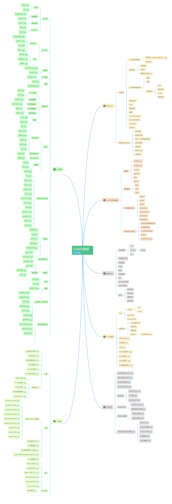
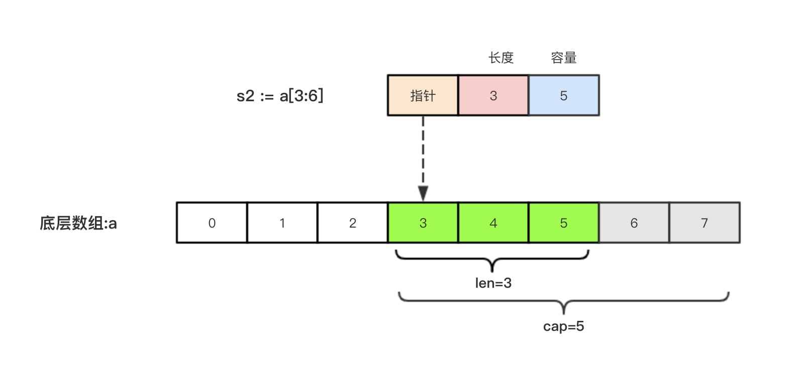
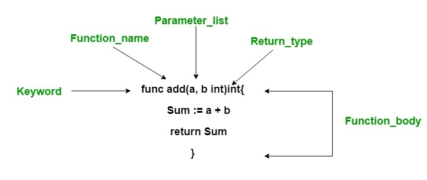
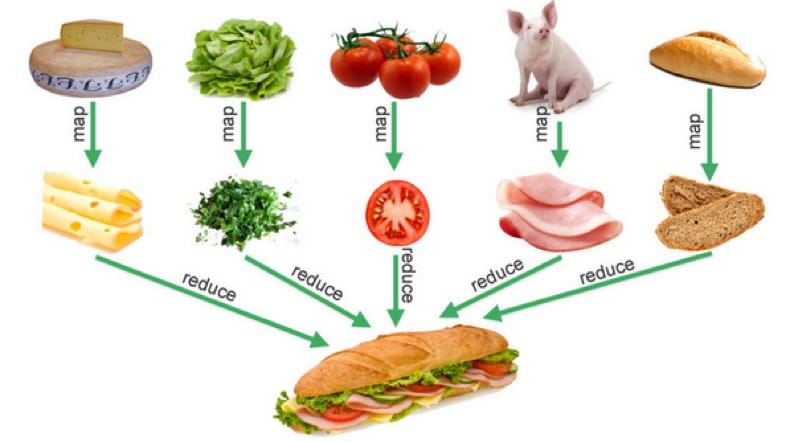
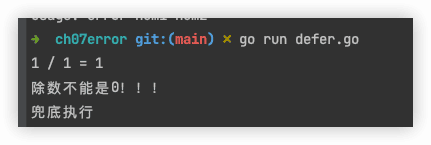
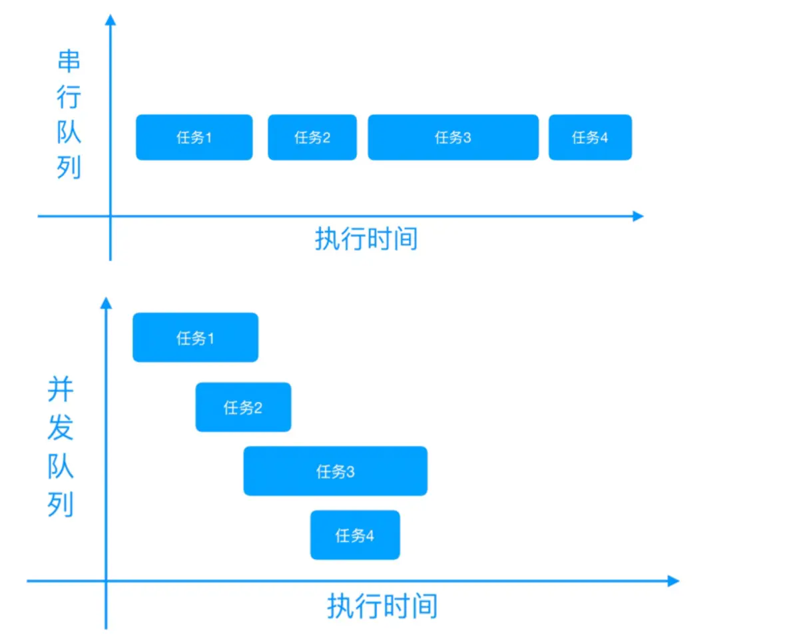
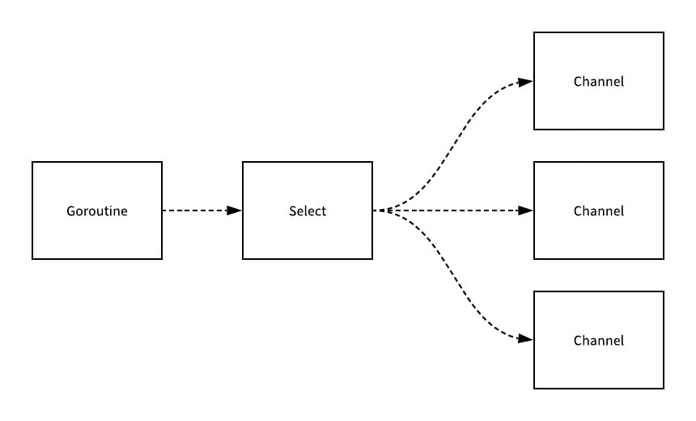
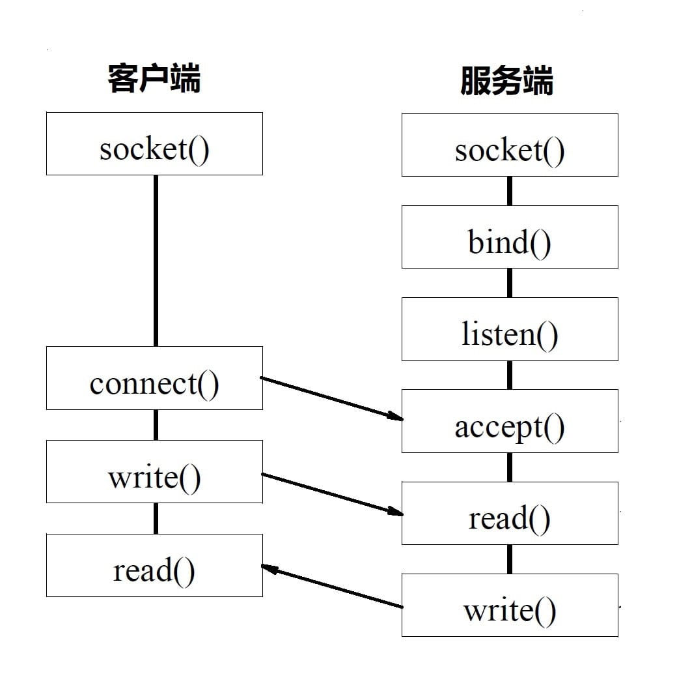

# Go入门教程

[Go 入门教程](https://laravelacademy.org/books/golang-tutorials)


## 1 开篇：为什么学习 Go 语言

 2009

静态的、强类型的、编译型编程语言，为并发而生

### 与C/C++对比

Go 设计的初衷是替代 C，所以二者有很多相似之处，但 Go 做的更多：

- 提供了==自动管理线程和垃圾回收的运行时==，在 C/C++ 中，需要自行管理线程和内存
- 更快的编译速度

适用场景不同：

- C/C++可用于高性能嵌入式系统、大型云应用以及桌面程序开发
- Go适用于系统和云平台开发

Go**不适用于高性能嵌入式系统**，因为嵌入式系统资源有限，而Go运行时调度线程和垃圾回收需要额外的开销。至今没有提供 GUI SDK，所以也**不适用于桌面程序开发**。

### 与Java对比


Java 程序编译之后需要安装额外的 Java runtime 运行，Java 程序的可移植性依赖 Java runtime，Go 不需要，Go运行时已经包含在这个编译的二进制文件中了，这体现在部署上的区别就是需要在服务器安装 Java runtime，而 Go 只需要部署单文件即可。

另外就是程序具体执行的时候，Go 被编译成二进制文件被所在操作系统执行，而 Java 通常是在包含了 JIT 编译器的 JVM 中执行，JIT 会对代码进行优化。

### 对比Python/PHP

Python/PHP 都是动态语言，而 Go 是静态语言，会做类型检查，可靠性更高。

开发 Web 应用时，Python/PHP 通常躲在 Nginx/Apache后面作为后台进程，Go则提供了内置的Web服务器，完全可以直接在生产环境使用。


Python/PHP 之所以要借助额外的 Web 服务器是因为**对并发请求的处理**，Python 有一个全局锁同时只允许运行一个线程，PHP 本身就没有多线程多进程机制，一次请求从头到位都是一个独立的进程，为了让基于 Python/PHP 的 Web 应用支持并发请求，必须借助外部 Web 服务器。

而 Go 内置的 Web 服务器充分利用了 `goroutine`，对并发连接有很好的支持。此外，由于协程的本质是**在同一个进程中调度不同线程**，所以还支持共享资源。

另外就是 Python/PHP 作为动态语言，性能不如 Go，如果要提升 Python/PHP 性能，必须通过 C 语言编写扩展，复杂度和学习成本太高。

### 对比JavaScript

这里的 JavaScript，主要是 Node.js。

JavaScript 是单线程模型，尽管异步 IO 机制可以使用不同的线程，主程序还是以单线程模式运行的，主程序代码耗时会阻塞其他代码的执行。

而 Go 语言的多线程模型可以通过运行时管理调度协程在多个处理器的不同线程中运行，可以充分利用系统硬件。

Node.js 使用 Google Chrome 的 V8 引擎，其中包含了带有 JIT 编译器的虚拟机，可以对 JavaScript 代码进行优化来提升性能，而 Go 代码直接被编译成机器码执行，没有类似的东西，也无此必要。

### 学习路线图

[官方文档](https://golang.org/doc/)



## 2 入门

### 第一个Go程序

```go
package main

import "fmt"

func main() {
	fmt.Println("Hello, world!")
}
```

和 Java 类似，Go 使用包作为基本单位来管理代码（可以类比为 PHP 中的命名空间），每个 Go 源代码文件的开头都是一个 `package` 声明，表示该文件中 Go 代码所属的包。包是 Go 语言里最基本的分发单位，也是工程管理中依赖关系的体现。

要生成 Go 可执行程序，==必须==声明一个名为 `main` 的包，并且在该包中包含一个名为 `main()` 的主函数，该函数是 Go 可执行程序的==执行起点==，这一点和 C 语言和 Java 语言很像，后续编译 Go 项目程序的时候也要从包含 `main` 包的文件开始。Go 语言的 `main()` 函数不能带参数，也不能定义返回值。

在包声明之后，是一系列的 `import` 语句，用于导入该程序所依赖的包（可类比为 PHP 中通过 `use` 引入其它命名空间的类来理解）。由于本示例程序用到了 `Println()` 函数，所以需要导入该函数所属的 `fmt` 包。

有一点需要注意，与 Java 和 PHP 不同，在 Go 语言中，**不得包含在源代码文件中没有用到的包**，否则 Go 编译器会报编译错误。这与下面的强制函数左花括号 `{` 的放置位置以及之后会提到的函数名的大小写规则，均体现了 Go 语言**在语言层面解决软件工程问题的设计哲学**。

所有 Go 函数（包括在面向对象编程中会提到的类型成员函数）都以关键字 `func` 开头（这一点与 PHP、Java、JavaScript 等语言通过 `function` 定义函数不同）。另外在 Go 函数中，左花括号 `{` 必须在函数定义行的末尾，不能另起一行，否则 Go 编译器会报编译错误。

#### 编译&运行程序

 `go build` 命令对 Go 程序进行编译，然后直接运行编译后的可执行文件执行 Go 程序代码：

```sh
➜ go build hello.go 
➜ ./hello 
Hello, world!
```

 `go run` 命令将编译和执行指令合二为一:

```sh
go run hello.go 
Hello, world!
```


### Go项目工程管理示例 🔖


### 单元测试、问题定位及代码调试

#### 单元测试

单元测试文件默认以同一目录下文件名后缀 `_test` 作为标识。

```go
package simplemath

import "testing"

func TestAdd(t *testing.T) {
    r := Add(1, 2)
    if r != 3 {
        t.Errorf("Add(1, 2) failed. Got %d, expected 3.", r)
    }
}
```

引入 [testing](https://golang.org/pkg/testing/) 包，类似PHP的PHPUnit或Java的JUnit。

#### 问题定位与调试

- 打印

```go
fval := 110.48 
ival := 200 
sval := "This is a string. " 
fmt.Println("The value of fval is", fval) 
fmt.Printf("fval=%f, ival=%d, sval=%s\n", fval, ival, sval) 
fmt.Printf("fval=%v, ival=%v, sval=%v\n", fval, ival, sval)
```

- 日志

 [log](https://golang.org/pkg/log/) 包


- IDE调试


- GDB调试


## 3 数据类型篇

### 3.1 变量、作用域、常量和枚举

#### 变量使用入门

##### 变量声明和命名规则

```go
var v1 int            // 整型
var v2 string         // 字符串
var (
    v1 int 
    v2 string
）

var v3 bool           // 布尔型
var v4 [10]int        // 数组，数组元素类型为整型
var v5 struct {       // 结构体，成员变量 f 的类型为64位浮点型
    f float64
} 
var v6 *int           // 指针，指向整型
var v7 map[string]int   // map（字典），key为字符串类型，value为整型
var v8 func(a int) int  // 函数，参数类型为整型，返回值类型为整型
```

变量在声明之后，系统会自动将变量值初始化为对应类型的零值。

**驼峰命名法**

##### 变量初始化

```go
var v1 int = 10   // 方式一，常规的初始化操作
var v2 = 10       // 方式二，此时变量类型会被编译器自动推导出来
v3 := 10          // 方式三，可以省略 var，编译器可以自动推导出v3的类型
```

纯粹的变量声明时可不能省略类型，那样会编译器会报错。

推导类型是在编译期做的，而不是运行时。

在 `:=` 运算符左侧的变量应该是未声明过的。

##### 变量赋值与多重赋值


```go
i, j = j, i
```

##### 匿名变量

在使用传统的强类型语言编程时，经常会出现这种情况，即在调用函数时为了获取一个值，却因为该函数返回多个值而不得不定义一堆没用的变量。

GO中使用多重赋值和匿名变量来避免这种丑陋的写法：

```go
_, nickName := GetName()
```


#### 变量的作用域

如果一个变量在函数体外声明，则被认为是全局变量，可以在整个包甚至外部包（变量名以大写字母开头）使用，不管你声明在哪个源文件里或在哪个源文件里调用该变量。

在函数体内声明的变量称之为局部变量，它们的作用域只在函数体内，函数的参数和返回值变量也是局部变量。


#### 常量使用入门

##### 常量定义

```go
const Pi float64 = 3.14159265358979323846 
const zero = 0.0 // 无类型浮点常量 
const (          // 通过一个 const 关键字定义多个常量，和 var 类似
    size int64 = 1024
    eof = -1  // 无类型整型常量 
) 
const u, v float32 = 0, 3  // u = 0.0, v = 3.0，常量的多重赋值 
const a, b, c = 3, 4, "foo" // a = 3, b = 4, c = "foo", 无类型整型和字符串常量
```

##### 预定义常量

`true`

`false` 

`iota` 一个可被编译器修改的常量，在每一个 `const` 关键字出现时被重置为 0，然后在下一个 `const` 出现之前，每出现一次 `iota`，其所代表的数字会自动增 1。

```go
package main

const (    // iota 被重置为 0
    c0 = iota   // c0 = 0
    c1 = iota   // c1 = 1
    c2 = iota   // c2 = 2
)

const (
    u = iota * 2;  // u = 0
    v = iota * 2;  // v = 2
    w = iota * 2;  // w = 4
)

const x = iota;  // x = 0
const y = iota;  // y = 0
```

如果两个 `const` 的赋值语句的表达式是一样的，那么还可以省略后一个赋值表达式。因此，上面的前两个 `const` 语句可简写为：

```go
const ( 
    c0 = iota 
    c1 
    c2 
)

const ( 
    u = iota * 2 
    v 
    w 
)
```

##### 枚举

Go 语言并不支持其他语言用于表示枚举的 `enum` 关键字，而是通过在 `const` 后跟一对圆括号定义一组常量的方式来实现枚举。

```go
const (
    Sunday = iota 
    Monday 
    Tuesday 
    Wednesday 
    Thursday 
    Friday 
    Saturday 
    numberOfDays
)
```

#### 常量的作用域

和函数体外声明的变量一样，以大写字母开头的常量在包外可见（类似于 `public` 修饰的类属性）；

以小写字母开头的常量只能在包内访问（类似于通过 `protected` 修饰的类属性）；

函数体内声明的常量只能在函数体内生效。


### 3.2 Go支持的数据类型概述及布尔类型

Go 语言内置对以下这些基本数据类型的支持：

- 布尔类型：bool
- 整型：int8、byte、int16、int、uint、uintptr 等
- 浮点类型：float32、float64
- 复数类型：complex64、complex128
- 字符串：string
- 字符类型：rune
- 错误类型：error

此外，Go 语言还支持以下这些复合类型：

- 指针（pointer）
- 数组（array）
- 切片（slice）
- 字典（map）
- 通道（chan） 【主要用于并发编程时不同协程之间的通信】
- 结构体（struct）
- 接口（interface）

结构体类似于面向对象编程语言中的类（class），Go 沿用了 C 语言的这一复合类型，而没有像传统面向对象编程那样引入单独的类概念。


### 3.3 整型及运算符

#### 整型

| 类型      | 长度（单位：字节） | 说明                                 | 值范围                                   | 默认值 |
| --------- | ------------------ | ------------------------------------ | ---------------------------------------- | ------ |
| `int8`    | 1                  | 带符号8位整型                        | -128~127                                 | 0      |
| `uint8`   | 1                  | 无符号8位整型，与 `byte` 类型等价    | 0~255                                    | 0      |
| `int16`   | 2                  | 带符号16位整型                       | -32768~32767                             | 0      |
| `uint16`  | 2                  | 无符号16位整型                       | 0~65535                                  | 0      |
| `int32`   | 4                  | 带符号32位整型，与 `rune` 类型等价   | -2147483648~2147483647                   | 0      |
| `uint32`  | 4                  | 无符号32位整型                       | 0~4294967295                             | 0      |
| `int64`   | 8                  | 带符号64位整型                       | -9223372036854775808~9223372036854775807 | 0      |
| `uint64`  | 8                  | 无符号64位整型                       | 0~18446744073709551615                   | 0      |
| `int`     | 32位或64位         | 与具体平台相关                       | 与具体平台相关                           | 0      |
| `uint`    | 32位或64位         | 与具体平台相关                       | 与具体平台相关                           | 0      |
| `uintptr` | 与对应指针相同     | 无符号整型，足以存储指针值的未解释位 | 32位平台下为4字节，64位平台下为8字节     | 0      |

和其他编程语言一样，可以通过增加前缀 `0` 来表示八进制数（如：077），增加前缀 `0x` 来表示十六进制数（如：0xFF），以及使用 `E` 来表示 10 的连乘（如：`1E3 = 1000`）。


#### 运算符

`+`、`-`、`*`、`/` 和 `%`（取余运算只能用于整数）

在 Go 语言中，也支持自增/自减运算符，即 `++`/`--`，但是只能作为语句，不能作为表达式，且只能用作后缀，不能放到变量前面。

支持 `+=`、`-=`、`*=`、`/=`、`%=` 


 `>`、`<`、`==`、`>=`、`<=` 和 `!=`，比较运算符运行的结果是布尔值。


| 位运算符 | 含义     | 结果                                           |
| -------- | -------- | ---------------------------------------------- |
| `x & y`  | 按位与   | 把 x 和 y 都为 1 的位设为 1                    |
| `x | y`  | 按位或   | 把 x 或 y 为 1 的位设为 1                      |
| `x ^ y`  | 按位异或 | 把 x 和 y 一个为 1 一个为 0 的位设为 1         |
| `^x`     | 按位取反 | 把 x 中为 0 的位设为 1，为 1 的位设为 0        |
| `x << y` | 左移     | 把 x 中的位向左移动 y 次，每次移动相当于乘以 2 |
| `x >> y` | 右移     | 把 x 中的位向右移动 y 次，每次移动相当于除以 2 |


| 逻辑运算符 | 含义                | 结果                                                   |
| ---------- | ------------------- | ------------------------------------------------------ |
| `x && y`   | 逻辑与运算符（AND） | 如果 x 和 y 都是 true，则结果为 true，否则结果为 false |
| `x || y`   | 逻辑或运算符（OR）  | 如果 x 或 y 是 true，则结果为 true，否则结果为 false   |
| `!x`       | 逻辑非运算符（NOT） | 如果 x 为 true，则结果为 false，否则结果为 true        |


##### 运算符优先级

由上到下表示优先级从高到低，或者数字越大，优先级越高：

```go
6      ^（按位取反） !
5      *  /  %  <<  >>  &  &^
4      +  -  |  ^（按位异或）
3      ==  !=  <  <=  >  >=
2      &&
1      ||
```


### 3.4 浮点型与复数类型

#### 浮点型

Go 语言中的浮点数采用[IEEE-754](https://zh.wikipedia.org/zh-hans/IEEE_754) 标准的表达方式，定义了两个类型：`float32` 和 `float64`，其中 `float32` 是单精度浮点数，可以精确到小数点后 7 位（类似 PHP、Java 等语言的 `float` 类型），`float64` 是双精度浮点数，可以精确到小数点后 15 位（类似 PHP、Java 等语言的 `double` 类型）。

```go
var floatValue1 float32

floatValue1 = 10
floatValue2 := 10.0 // 如果不加小数点，floatValue2 会被推导为整型而不是浮点型
floatValue3 := 1.1E-10
```

对于浮点类型需要被自动推导的变量，其类型将被自动设置为 `float64`，而不管赋值给它的数字是否是用 32 位长度表示的。

```go
// 编译报错 ：cannot use floatValue2 (type float64) as type float32 in assignment
floatValue1 = floatValue2  // floatValue2 是 float64 类型
```

必须强制转换：

```go
floatValue1 = float32(floatValue2)
```

> 在实际开发中，应该尽可能地使用 `float64` 类型，因为 [math](https://golang.org/pkg/math/) 包中所有有关数学运算的函数都会要求接收这个类型。

##### 浮点数的比较

浮点数支持通过算术运算符进行四则运算，也支持通过比较运算符进行比较（前提是运算符两边的操作数类型一致），但是涉及到相等的比较除外，因为我们上面提到，看起来相等的两个十进制浮点数，**在底层转化为二进制时会丢失精度**，因此不能被表象蒙蔽。

替代的解决方案：

```go
p := 0.00001
// 判断 floatValue1 与 floatValue2 是否相等
if math.Dim(float64(floatValue1), floatValue2) < p {
    fmt.Println("floatValue1 和 floatValue2 相等")
} 
```

一种近似判断，通过一个可以接受的最小误差值 `p`，约定如果两个浮点数的差值在此精度的误差范围之内，则判定这两个浮点数相等。这个解决方案**也是其他语言判断浮点数相等所采用的通用方案**。

#### 复数类型

把整型和浮点型这种日常比较常见的数字称为实数，复数是实数的延伸，可以通过两个实数（在计算机中用浮点数表示）构成，一个表示实部（real），一个表示虚部（imag），常见的表达形式如下：

```go
z = a + bi
```

其中 a、b 均为实数，i 称为虚数单位，当 b = 0 时，z 就是常见的实数，当 a = 0 而 b ≠ 0 时，将 z 称之为**纯虚数**。


在 Go 语言中，复数支持两种类型：`complex64`（32 位实部和虚部） 和 `complex128`（64 位实部与虚部）。


### 3.5 字符串及底层字符类型

#### 字符串

##### 1️⃣基本使用

在 Go 语言中，字符串是一种基本类型，默认是通过 UTF-8编码的字符序列，当字符为 ASCII 码时则占用 1 个字节，其它字符根据需要占用 2-4 个字节，比如中文编码通常需要 3 个字节。

###### 声明和初始化

###### 格式化输出

###### 转义字符

###### 多行字符串

```go
results := `Search results for "Golang":
- Go
- Golang
Golang Programming
`
fmt.Printf("%s", results)
```


##### 2️⃣不可变值类型

在 Go 语言中，字符串是一种不可变值类型

```go
str := "Hello world"
str[0] = 'X' // 编译错误
```


##### 3️⃣字符编码

如果你的 Go 代码需要包含非 ANSI 字符，保存源文件时请注意编码格式必须选择 UTF-8。特别是在 Windows 下一般编辑器都默认保存为本地编码，比如中国地区可能是 GBK 编码而不是 UTF-8。

字符串的编码转换是处理文本文档（比如 TXT、XML、HTML 等）时非常常见的需求，不过 Go 语言默认仅支持 UTF-8 和 Unicode 编码，对于其他编码，Go 语言标准库并没有内置的编码转换支持。


##### 4️⃣字符串操作


###### 字符串连接


###### 字符串切片

**==左闭右开==**


> 此外 Go 字符串也支持字符串比较、是否包含指定字符/子串、获取指定子串索引位置、字符串替换、大小写转换、trim 等操作，请参考标准库 [strings](https://golang.org/pkg/strings/) 包。

##### 5️⃣字符串遍历

1. 以**字节数组**的方式遍历：

```go
str := "Hello, 世界" 
n := len(str) 
for i := 0; i < n; i++ {
    ch := str[i]    // 依据下标取字符串中的字符，ch 类型为 byte
    fmt.Println(i, ch) 
}
```

结果长度为13，是字节`byte`

2. 以 **Unicode 字符**遍历：

```go
str := "Hello, 世界" 
for i, ch := range str { 
    fmt.Println(i, ch)    // ch 的类型为 rune 
}
```

结果长度为9，是字符`rune`


#### 底层字符类型

Go 语言对字符串中的单个字符进行了单独的类型支持，在 Go 语言中支持两种字符类型：

- 一种是 `byte`，代表 UTF-8 编码中单个字节的值（它也是 `uint8` 类型的别名，两者是等价的，因为正好占据 1 个字节的内存空间）；
- 另一种是 `rune`，代表单个 Unicode 字符（它也是 `int32` 类型的别名，因为正好占据 4 个字节的内存空间。关于 `rune` 相关的操作，可查阅 Go 标准库的 [unicode](https://golang.org/pkg/unicode/) 包）。

##### UTF-8 和 Unicode 的区别


##### 将 Unicode 编码转化为可打印字符


### 3.6 基本数据类型之间的转化

由于 Go 是强类型语言，所以不支持动态语言那种自动转化，而是要对变量进行强制类型转化。

#### 数值类型之间的转化

##### 整型之间的转化

```go
v1 := uint(16)   // 初始化 v1 类型为 unit
v2 := int8(v1)   // 将 v1 转化为 int8 类型并赋值给 v2
v3 := uint16(v2) // 将 v2 转化为 uint16 类型并赋值给 v3
```


##### 原码、反码和补码 🔖


##### 整型与浮点型之间的转化

```go
v1 := 99.99
v2 := int(v1)  // v2 = 99  小数位被丢弃
```


#### 字符串和其他基本类型之间的转化

##### 将整型转化为字符串

整型数据可以通过 Unicode 字符集转化为对应的 UTF-8 编码的字符串：

```go
v1 := 65
v2 := string(v1)  // v2 = A

v3 := 30028
v4 := string(v3)  // v4 = 界
```

还可以将 `byte` 数组或者 `rune` 数组转化为字符串，因为字符串底层就是通过这两个基本字符类型构建的：

```go
v1 := []byte{'h', 'e', 'l', 'l', 'o'}
v2 := string(v1)  // v2 = hello

v3 := []rune{0x5b66, 0x9662, 0x541b}
v4 := string(v3)  // v4 = 学院君
```

`byte` 是 `uint8` 的别名，`rune` 是 `int32` 的别名，所以也可以看做是整型数组和字符串之间的转化。

##### strconv包

Go 语言默认不支持将字符串类型强制转化为数值类型，即使字符串中包含数字也不行。

如果要实现更强大的基本数据类型与字符串之间的转化，可以使用 Go 官方 `strconv` 包提供的函数：

```go
v1 := "100"
v2, _ := strconv.Atoi(v1)  // 将字符串转化为整型，v2 = 100

v3 := 100
v4 := strconv.Itoa(v3)   // 将整型转化为字符串, v4 = "100"

v5 := "true"
v6, _ := strconv.ParseBool(v5)  // 将字符串转化为布尔型
v5 = strconv.FormatBool(v6)  // 将布尔值转化为字符串

v7 := "100"
v8, _ := strconv.ParseInt(v7, 10, 64)   // 将字符串转化为整型，第二个参数表示进制，第三个参数表示最大位数
v7 = strconv.FormatInt(v8, 10)   // 将整型转化为字符串，第二个参数表示进制

v9, _ := strconv.ParseUint(v7, 10, 64)   // 将字符串转化为无符号整型，参数含义同 ParseInt
v7 = strconv.FormatUint(v9, 10)  // 将无符号整数型转化为字符串，参数含义同 FormatInt

v10 := "99.99"
v11, _ := strconv.ParseFloat(v10, 64)   // 将字符串转化为浮点型，第二个参数表示精度
v10 = strconv.FormatFloat(v11, 'E', -1, 64)

q := strconv.Quote("Hello, 世界")    // 为字符串加引号
q = strconv.QuoteToASCII("Hello, 世界")  // 将字符串转化为 ASCII 编码
```


### 3.7 数组使用入门及其不足

#### 数组的声明和初始化

在 Go 语言中，数组是固定长度的、同一类型的数据集合。数组中包含的每个数据项被称为数组元素，一个数组包含的元素个数被称为数组的长度。

```go
[capacity]data_type{element_values}
```


```go
var a [8]byte // 长度为8的数组，每个元素为一个字节
var b [3][3]int // 二维数组（9宫格）
var c [3][3][3]float64 // 三维数组（立体的9宫格）
var d = [3]int{1, 2, 3}  // 声明时初始化
var e = new([3]string)   // 通过 new 初始化

a := [5]int{1,2,3,4,5}
a := [...]int{1, 2, 3}  // 语法糖，省略数组长度的声明
a := [5]int{1, 2, 3}  // 如果没有填满，则空位会通过对应的元素类型零值填充
a := [5]int{1: 3, 3: 7} // 还可以初始化指定下标位置的元素值，未设置的位置也会以对应元素类型的零值填充
```

数组长度在声明后就不可更改，在声明时可以指定数组长度为一个常量或者一个常量表达式（常量表达式是指在编译期即可计算结果的表达式）。数组的长度是该数组类型的一个内置常量，可以用 Go 语言的内置函数 `len()` 来获取

#### 数组元素的访问和设置


#### 遍历数组


Go 语言还提供了一个关键字 `range`，用于以更优雅的方式遍历数组中的元素：

```go
for i, v := range arr { 
    fmt.Println("Element", i, "of arr is", v) 
}
```

```go
for _, v := range arr {
   // ...
}
for i := range arr {
   // ...
}
```

#### 多维数组

```go
// 通过二维数组生成九九乘法表
var multi [9][9]string
for j := 0; j < 9; j++ {
    for i := 0; i < 9; i++ {
            n1 := i + 1
            n2 := j + 1
            if n1 < n2 {  // 摒除重复的记录
                continue
            }
            multi[i][j] = fmt.Sprintf("%dx%d=%d", n2, n1, n1 * n2)
        }
  }

// 打印九九乘法表
for _, v1 := range multi {
    for _, v2 := range v1 {
        fmt.Printf("%-8s", v2)  // 位宽为8，左对齐
    }
    fmt.Println()
}
```


#### 数组类型的不足

- 长度固定

- 值类型

切片类型，一个引用类型的、支持动态添加元素的新「数组」类型。

>  在Go语言中很少使用数组，大多数时候会使用切片取代它。

### 3.8 切片

#### 1️⃣切片的定义

在 Go 语言中，切片是一个新的数据类型，与数组最大的不同在于，切片的类型字面量中只有元素的类型，没有长度：

```go
var slice []string = []string{"a", "b", "c"}
```


切片是一个可变长度的、同一类型元素集合，切片的长度可以随着元素数量的增长而增长（但**不会随着元素数量的减少而减少**），不过切片从底层管理上来看依然使用数组来管理元素，可以看作是**对数组做了一层简单的封装**。基于数组，切片添加了一系列管理功能，可以随时动态扩充存储空间。


#### 2️⃣创建切片

##### 基于数组

切片可以只使用数组的一部分元素或者整个数组来创建，甚至可以创建一个比所基于的数组还要大的切片：

```go
// 先定义一个数组
months := [...]string{"January", "February", "March", "April", "May", "June", "July", "August", "September", "October", "November", "December"}

// 基于数组创建切片
q2 := months[3:6]    // 第二季度
summer := months[5:8]  // 夏季

fmt.Println(q2)
fmt.Println(summer)  
```

Go 语言支持通过 `array[start:end]` 这样的方式基于数组生成一个切片，`start` 表示切片在数组中的下标起点，`end` 表示切片在数组中的下标终点，两者之间的元素就是切片初始化后的元素集合。和字符串切片一样，这也是个**左闭右开**的集合。

切片底层引用了一个数组，由三个部分构成 —— **指针、长度和容量**，指针指向数组起始下标，长度对应切片中元素的个数，容量则是切片起始位置到底层数组结尾的位置：



切片长度不能超过容量。内置函数 `len` 获取切片的长度， `cap` 函数获取切片容量

##### 基于切片

```go
firsthalf := months[:6]
q1 := firsthalf[:3] // 基于 firsthalf 的前 3 个元素构建新切片
```


```go
q1 := firsthalf[:9]
// q1结果 [January February March April May June July August September]
```

因为 `firsthalf` 的容量是 12，只要选择的范围不超过 `firsthalf` 的容量，那么这个创建操作就是合法的，所以虽然是基于切片创建切片，但本质上还是基于数组。


##### 直接创建

内置函数 `make()` 可以用于灵活地创建切片。

```go
mySlice1 := make([]int, 5)  // 初始长度为 5 
mySlice2 := make([]int, 5, 10)  // 初始长度为 5、容量为 10
mySlice3 := []int{1, 2, 3, 4, 5}  // 长度和容量均为5
```

#### 3️⃣遍历切片


#### 4️⃣动态增加元素

一个切片的容量初始值根据创建方式的不同而不同：

- 对于基于数组和切片创建的切片而言，默认容量是从切片起始索引到对应底层数组的结尾索引；
- 对于通过内置 `make` 函数创建的切片而言，在没有指定容量参数的情况下，默认容量和切片长度一致。

```go
var oldSlice = make([]int, 5, 10)  // [0 0 0 0 0]

newSlice := append(oldSlice, 1, 2, 3)  // [0 0 0 0 0 1 2 3]
```

```go
appendSlice := []int{1, 2, 3, 4, 5}
newSlice := append(oldSlice, appendSlice...)  // 注意末尾的 ... 不能省略
```


##### 自动扩容

如果追加的元素个数超出 `oldSlice` 的默认容量，则底层会自动进行扩容。


##### 内容复制

内置函数 `copy()`，用于将元素从一个切片复制到另一个切片。如果两个切片不一样大，就会按其中较小的那个切片的元素个数进行复制。

```go
slice1 := []int{1, 2, 3, 4, 5} 
slice2 := []int{5, 4, 3}

// 复制 slice1 到 slice 2
copy(slice2, slice1) // 只会复制 slice1 的前3个元素到 slice2 中
// slice2 结果: [1, 2, 3]
// 复制 slice2 到 slice 1
copy(slice1, slice2) // 只会复制 slice2 的 3 个元素到 slice1 的前 3 个位置
// slice1 结果：[5, 4, 3, 4, 5]
```


#### 5️⃣动态删除元素

```go
slice3 := []int{1, 2, 3, 4, 5, 6, 7, 8, 9, 10}
slice3 = slice3[:len(slice3) - 5]  // 删除 slice3 尾部 5 个元素
slice3 = slice3[5:]  // 删除 slice3 头部 5 个元素
```


```go
slice3 := []int{1, 2, 3, 4, 5, 6, 7, 8, 9, 10}
    
slice4 := append(slice3[:0], slice3[3:]...)  // 删除开头三个元素
slice5 := append(slice3[:1], slice3[4:]...)  // 删除中间三个元素
slice6 := append(slice3[:0], slice3[:7]...)  // 删除最后三个元素
slice7 := slice3[:copy(slice3, slice3[3:])]  // 删除开头前三个元素
```


> 关于 Go 切片元素的动态插入、新增、删除操作，[go切片图示](https://ueokande.github.io/go-slice-tricks/)


#### 6️⃣数据共享问题 🔖

切片底层是基于数组实现的，对应的结构体对象：

```go
type slice struct {
    array unsafe.Pointer //指向存放数据的数组指针
    len   int            //长度有多大
    cap   int            //容量有多大
}
```


解决方案


### 3.9 字典

#### 字典声明和初始化

需要在声明时指定键和值的类型。

Go字典是个无序集合，底层不会按照元素添加顺序维护元素的存储顺序。

```go
var testMap map[string]int
testMap = map[string]int{
  "one": 1,
  "two": 2,
  "three": 3,
}

k := "two"
v, ok := testMap[k]
if ok {
  fmt.Printf("The element of key %q: %d\n", k, v)
} else {
  fmt.Println("Not found!")
}
```

还可以像切片一样，通过`make()`初始化：

```go
var testMap = make(map[string]int)

testMap = make(map[string]int, 100)   // 指定该字典的初始存储容量（超出会自动扩容）
```

#### 使用入门

```go
// 赋值
testMap["four"] = 4

// 查找元素，第二个返回布尔值用于判断查找是否成功
value, ok := testMap["one"] 
if ok { // 找到了
  // 处理找到的value 
}

//删除元素
delete(testMap, "four")

// 遍历字典
for key, value := range testMap {
    fmt.Println(key, value)
}

// 键值对调
invMap := make(map[int] string, 3)
for k, v := range testMap {
    invMap[v] = k
}

```


> 🔖
>
> Go 语言中的字典和 Redis 一样，底层也是通过哈希表实现的，添加键值对到字典时，实际是将键转化为哈希值进行存储，在查找时，也是先将键转化为哈希值去哈希表中查询，从而提高性能。
>
> 但是哈希表存在哈希冲突问题，即不同的键可能会计算出同样的哈希值，这个时候 Go 底层还会判断原始键的值是否相等。也正因如此，我们在声明字典的键类型时，要求数据类型必须是支持通过 == 或 != 进行判等操作的类型，比如数字类型、字符串类型、数组类型、结构体类型等，不过为了提高字典查询性能，类型长度越短约好，通常，我们会将其设置为整型或者长度较短的字符串类型。

#### 字典排序

字典是一个无序集合，如果你想要对字典进行排序，可以通过分别为字典的键和值创建切片，然后通过对切片进行排序来实现。

##### 按照键进行排序

```go
keys := make([]string, 0)
for k, _ := range testMap {
    keys = append(keys, k)
}

sort.Strings(keys)  // 对键进行排序

fmt.Println("Sorted map by key:")
for _, k := range keys {
    fmt.Println(k, testMap[k])
}
```

##### 按照值进行排序

```go
values := make([]int, 0)
for _, v := range testMap {
    values = append(values, v)
}

sort.Ints(values)   // 对值进行排序

fmt.Println("Sorted map by value:")
for _, v := range values  {
    fmt.Println(invMap[v], v)
}
```


### 3.10 指针 🔖


**变量**的本质对一块内存空间的命名，我们可以通过引用变量名来使用这块内存空间存储的值，而指针则是用来指向这些变量值所在**内存地址的值**。


#### unsafe.Pointer


## 4 流程控制篇

- 条件语句：用于条件判断，对应的关键字有 `if`、`else` 和 `else if`；
- 分支语句：用于分支选择，对应的关键字有 `switch`、`case`、`fallthrough`和 `select`（用于通道，后面介绍协程时会提到）；
- 循环语句：用于循环迭代，对应的关键字有 `for` 和 `range`；
- 跳转语句：用于代码跳转，对应的关键字有 `goto`。

### 条件语句

```go
// if
if condition { 
    // do something 
}

// if...else...
if condition { 
    // do something 
} else {
    // do something 
}

// if...else if...else...
if condition1 { 
    // do something 
} else if condition2 {
    // do something else 
} else {
    // catch-all or default 
}
```

- 条件语句不需要使用圆括号将条件包含起来 `()`；
- 无论语句体内有几条语句，花括号 `{}` 都是必须存在的；
- 左花括号 `{` 必须与 `if` 或者 `else` 处于同一行；
- 在 `if` 之后，条件语句之前，可以添加变量初始化语句，使用 `;` 间隔，比如上述代码可以这么写 `if score := 100; score > 90 {`

### 分支语句

```go
switch var1 {
    case val1:
        ... 
    case val2:
        ... 
    default:
        ...
}
```


```go
score := 100
switch {
case score >= 90:
    fmt.Println("Grade: A")
case score >= 80 && score < 90:
    fmt.Println("Grade: B")
case score >= 70 && score < 80:
    fmt.Println("Grade: C")
case score >= 60 && score < 70:
    fmt.Println("Grade: D")
default:
    fmt.Println("Grade: F")
}
```

只有在与 `case` 分支值判等的时候，才能把变量 `score` 放到 `switch` 关键字后面：

```go
score := 100
switch score {
case 90, 100:
    fmt.Println("Grade: A")
case 80:
    fmt.Println("Grade: B")
case 70:
    fmt.Println("Grade: C")
case 60:
case 65:
    fmt.Println("Grade: D")
default:
    fmt.Println("Grade: F")
}
```

合并分支：

```go
score := 60
switch score {
...
case 60:
    fallthrough
case 65:
    fmt.Println("Grade: D")
...
}
```


- 和条件语句一样，左花括号 `{` 必须与 `switch` 处于同一行；
- 单个 `case` 中，可以出现多个结果选项（通过逗号分隔）；
- 与其它语言不同，Go 语言不需要用 `break` 来明确退出一个 `case`；
- 只有在 `case` 中明确添加 `fallthrough` 关键字，才会继续执行紧跟的下一个 `case`；
- 可以不设定 `switch` 之后的条件表达式，在这种情况下，整个 switch 结构与多个 `if...else...` 的逻辑作用等同。


### 循环语句

```go
sum := 0 
for i := 1; i <= 100; i++ { 
    sum += i 
}
fmt.Println(sum)
```


无限循环：

```go
sum := 0
i := 0
for {
    i++
    if i > 100 {
        break
    }
    sum += i
}
fmt.Println(sum)
```


`for` 循环条件表达式中也支持多重赋值:

```go
a := []int{1, 2, 3, 4, 5, 6} 
for i, j := 0, len(a) – 1; i < j; i, j = i + 1, j – 1 { 
    a[i], a[j] = a[j], a[i] 
}
fmt.Println(a)  // [6 5 4 3 2 1]
```


for-range 结构:

```go
for k, v := range a {
    fmt.Println(k, v)
}
```

可用于可迭代的集合（数组、切片、字典）。


基于条件判断进行循环

```go
sum := 0
i := 0
for i < 100 {
    i++
    sum += i
}
fmt.Println(sum)
```


- 和条件语句、分支语句一样，左花括号 `{` 必须与 `for` 处于同一行；
- 不支持 `whie` 和 `do-while` 结构的循环语句；
- 可以通过 `for-range` 结构对可迭代集合进行遍历；
- 支持基于条件判断进行循环迭代；
- 允许在循环条件中定义和初始化变量，且支持多重赋值；
- Go 语言的 `for` 循环同样支持 `continue` 和 `break` 来控制循环，但是它提供了一个更高级的 `break`，可以选择中断哪一个循环


### 跳转语句


## 5 函数式编程篇

### 5.1 函数使用入门和常用内置函数

在 Go 语言中，函数主要有三种类型：

- 普通函数
- 匿名函数（闭包）
- 类方法

#### 函数定义

关键字 `func`、函数名、参数列表、返回值、函数体和返回语句



如果函数的参数列表中包含若干个类型相同的参数，则可以在参数列表中省略前面变量的类型声明，只保留最后一个:

```go
func add(a, b int) int { 
    // ...
}
```


#### 函数调用


**在调用其他包定义的函数时，只有函数名首字母大写的函数才可以被访问**。

Go 语言中没有 `public`、`protected`、`private` 之类的关键字，它是通过首字母的大小写来区分可见性的：首字母小写的函数只能在同一个包中访问，首字母大写的函数才可以在其他包中调用，Go 文件中定义的全局变量也是如此。


#### 系统内置函数

[builtin package - builtin - Go Packages](https://pkg.go.dev/builtin)

| 名称                      | 说明                                                         |
| ------------------------- | ------------------------------------------------------------ |
| `close`                   | 用于在管道通信中关闭一个管道                                 |
| `len`、`cap`              | `len` 用于返回某个类型的长度（字符串、数组、切片、字典和管道），`cap` 则是容量的意思，用于返回某个类型的最大容量（只能用于数组、切片和管道） |
| `new`、`make`             | `new` 和 `make` 均用于分配内存，`new` 用于值类型和用户自定义的类型（类），`make` 用于内置引用类型（切片、字典和管道）。它们在使用时将类型作为参数：`new(type)`、`make(type)`。`new(T)` 分配类型 T 的零值并返回其地址，也就是指向类型 T 的指针，可以用于基本类型：`v := new(int)`。`make(T)` 返回类型 T 的初始化之后的值，所以 `make` 不仅分配内存地址还会初始化对应类型。 |
| `copy`、`append`          | 分别用于切片的复制和动态添加元素                             |
| `panic`、`recover`        | 两者均用于错误处理机制                                       |
| `print`、`println`        | 打印函数，在实际开发中建议使用 [fmt](https://golang.org/pkg/fmt/) 包 |
| `complex`、`real`、`imag` | 用于复数类型的创建和操作                                     |


### 5.2 参数传递、变长参数与多返回值


#### 1️⃣传递参数

按值传参

引用传参

#### 2️⃣变长参数

所谓变长参数指的是函数参数的数量不确定，可以按照需要传递任意数量的参数到指定函数，合适地使用变长参数，可以让代码更简洁，尤其是输入输出类函数，比如打印函数 `fmt.Printf` 的参数就是典型的变长参数。

##### 基本定义和传值

只需要在参数类型前加上 `...` 前缀，就可以将该参数声明为变长参数：

```go
func myfunc(numbers ...int) {
    for _, number := range numbers {
        fmt.Println(number)
    }
}
```

这种变长参数还支持传递一个 `[]int` 类型的切片，传递切片时需要在末尾加上 `...` 作为标识，表示对应的参数类型是变长参数：

```go
slice := []int{1, 2, 3, 4, 5}
myfunc(slice...)
myfunc(slice[1:3]...)
```

> 注：形如 `...type` 格式的类型只能作为函数的参数类型存在，并且必须是函数的最后一个参数。

之所以支持传入切片，是因为从底层实现原理上看，类型 `...type` 本质上是一个切片，也就是 `[]type`，这也是为什么上面的参数 `numbers` 可以用 `for` 循环来获取每个传入的参数值。


##### 任意类型的变长参数（泛型）

指定变长参数类型为 `interface{}`：

```go
func Printf(format string, args ...interface{}) { 
    // ...
}
```

自定义一个支持任意类型的变长参数函数：

```go
func myPrintf(args ...interface{}) {
    for _, arg := range args {
        switch reflect.TypeOf(arg).Kind() {
        case reflect.Int:
            fmt.Println(arg, "is an int value.")
        case reflect.String:
            fmt.Printf("\"%s\" is a string value.\n", arg)
        case reflect.Array:
            fmt.Println(arg, "is an array type.")
        default:
            fmt.Println(arg, "is an unknown type.")
        }
    }
}

func main() {
    myPrintf(1, "1", [1]int{1}, true)
}
```

其实这里就是一个**泛型**功能，Go 语言并没有在语法层面提供对泛型的支持，所以目前只能自己这样通过反射和 `interface{}` 类型实现。

`interface{}` 是一个**空接口**，可以用于表示任意类型。


#### 3️⃣多返回值

```go
func add(a, b *int) (int, error) {
    if *a < 0 || *b < 0 {
        err := errors.New("只支持非负整数相加")
        return 0, err
    }
    *a *= 2
    *b *= 3
    return *a + *b, nil
}

func main()  {
    x, y := -1, 2
    z, err := add(&x, &y)
    if err != nil {
        fmt.Println(err.Error())
        return
    }
    fmt.Printf("add(%d, %d) = %d\n", x, y, z)
}
```


##### 命名返回值

在设置多返回值时，还可以对返回值进行变量命名，这样，我们就可以在函数中直接对返回值变量进行赋值，而不必每次都按照指定的返回值格式返回多个变量了：

```go
func add(a, b *int) (c int, err error) {
    if *a < 0 || *b < 0 {
        err = errors.New("只支持非负整数相加")
        return
    }
    *a *= 2
    *b *= 3
    c = *a + *b
    return
}
```


### 5.3 匿名函数与闭包

#### 1️⃣匿名函数的定义和使用

==匿名函数==是一种没有指定函数名的函数声明方式（与之相对的，有名字的函数被称为==具名函数==）。

```go
// 1、将匿名函数赋值给变量
add := func(a, b int) int {
    return a + b
}

// 调用匿名函数 add
fmt.Println(add(1, 2))  

// 2、定义时直接调用匿名函数
func(a, b int) {
    fmt.Println(a + b)
} (1, 2) 
```

#### 2️⃣匿名函数与闭包

所谓闭包指的是引用了自由变量（未绑定到特定对象的变量，通常在函数外定义）的函数，被引用的自由变量将和这个函数一同存在，即使已经离开了创造它的上下文环境也不会被释放（比如传递到其他函数或对象中）。简单来说，「闭」的意思是「封闭外部状态」，**即使外部状态已经失效，闭包内部依然保留了一份从外部引用的变量**。

闭包只能通过匿名函数实现，我们可以把闭包看作是**有状态的匿名函数**，反过来，如果匿名函数引用了外部变量，就形成了一个闭包（Closure）。

支持闭包的语言都将函数作为**第一类对象**（firt-class object，有的地方也译作第一级对象、一等公民等，都是一个意思），Go语言也不例外，这意味 Go 函数和普通Go数据类型（整型、字符串、数组、切片、字典、结构体等）具有同等的地位，可以赋值给变量，也可以作为参数传递给其他函数，还能够被函数动态创建和返回。

> 注：所谓第一类对象指的是运行期可以被创建并作为参数传递给其他函数或赋值给变量的实体，在绝大多数语言中，数值和基本类型都是第一类对象，在支持闭包的编程语言中（比如 Go、PHP、JavaScript、Python 等），函数也是第一类对象，而像 C、C++ 等不支持匿名函数的语言中，函数不能在运行期创建，所以在这些语言中，函数不是第一类对象。

#### 3️⃣匿名函数的常见使用场景

##### 保证局部变量的安全性


##### 将匿名函数作为函数参数

```go
add := func(a, b int) int {
    return a + b
}

// 将函数类型作为参数
func(call func(int, int) int) {
    fmt.Println(call(1, 2))
}(add)
```


##### 将匿名函数作为函数返回值

```go
// 将函数作为返回值类型
func deferAdd(a, b int) func() int {
    return func() int {
        return a + b
    }
}

func main() {
    ...

    // 此时返回的是匿名函数
    addFunc := deferAdd(1, 2)
    // 这里才会真正执行加法操作
    fmt.Println(addFunc())
}
```


### 5.4 通过高阶函数实现装饰器模式 

#### 高阶函数

高阶函数，就是接收其他函数作为参数传入，或者把其他函数作为结果返回的函数。

#### 装饰器模式

装饰器模式（Decorator）是一种软件设计模式，其应用场景是为某个已经存在的功能模块（类或者函数）添加一些「装饰」功能，而又不会侵入和修改原有的功能模块。就好比我们给房间做节日装饰一样，它不会调整这个房间原有的任何固有框架，而又让房间充满节日气氛。

有过 Python、Java 编程经验的同学应该对这个模式很熟悉，在 Python、Java 中，我们可以通过注解非常优雅地实现装饰器模式，比如给某个功能模块添加日志功能、或者为路由处理器添加中间件功能，这些都可以通过装饰器实现。

不过 Go 语言的设计哲学就是简单，没有提供「注解」之类的语法糖，在函数式编程中，要实现装饰器模式，可以借助高阶函数来实现。

#### 通过高阶函数实现装饰器模式

##### 

```go
package main

import (
	"fmt"
	"time"
)
/*
	通过高阶函数实现装饰器模式
*/

// 为函数类型设置别名提高代码可读性
type MultiPlyFunc func(int, int) int

// 乘法运算函数
func multiply(a, b int) int {
	return a * b
}

// 通过高阶函数在不侵入原有函数实现的前提下计算乘法函数执行时间
func execTime(f MultiPlyFunc) MultiPlyFunc {
	return func(a, b int) int {
		start := time.Now()      // 起始时间
		c := f(a, b)             // 执行乘法运算函数
		end := time.Since(start) // 函数执行完毕耗时
		fmt.Printf("--- 执行耗时: %v ---\n", end)
		return c // 返回计算结果
	}
}

func main() {
	a := 2
	b := 8
	// 通过修饰器调用乘法函数，返回的是一个匿名函数
	decorator := execTime(multiply)
	// 执行修饰器返回函数
	c := decorator(a, b)
	fmt.Printf("%d x %d = %d\n", a, b, c)
}
```

结果：

```sh
$ go run decorator.go 
--- 执行耗时: 166ns ---
2 x 8 = 16

```

核心思路就是在被修饰的功能模块（这里是外部传入的乘法函数 `f`）执行前后加上一些额外的业务逻辑，而又不影响原有功能模块的执行。显然，装饰器模式是遵循 SOLID 设计原则中的开放封闭原则的 —— 对代码扩展开放，对代码修改关闭。

### 5.5 递归函数及性能调优  🔖

#### 递归函数及编写思路

在实际开发过程中，某个问题满足以下条件就可以通过递归函数来解决：

- 一个问题的解可以被拆分成多个子问题的解
- 拆分前的原问题与拆分后的子问题除了数据规模不同，求解思路完全一样
- 子问题存在递归终止条件

#### 通过斐波那契数列求解演示


#### 递归函数性能优化

##### 递归函数执行耗时对比

```go
package main

import (
    "fmt"
    "time"
)

type FibonacciFunc func(int) int

// 通过递归函数实现斐波那契数列
func fibonacci(n int) int {
    // 终止条件
    if n == 1 {
        return 0
    }
    if n == 2 {
        return 1
    }
    // 递归公式
    return fibonacci(n-1) + fibonacci(n-2)
}

// 斐波那契函数执行耗时计算
func fibonacciExecTime(f FibonacciFunc) FibonacciFunc {
    return func(n int) int {
        start := time.Now() // 起始时间
        num := f(n)  // 执行斐波那契函数
        end := time.Since(start) // 函数执行完毕耗时
        fmt.Printf("--- 执行耗时: %v ---\n", end)
        return num  // 返回计算结果
    }
}

func main() {
    n1 := 5
    f := fibonacciExecTime(fibonacci)
    r1 := f(n1)
    fmt.Printf("The %dth number of fibonacci sequence is %d\n", n1, r1)

    n2 := 50
    r2 := f(n2)
    fmt.Printf("The %dth number of fibonacci sequence is %d\n", n2, r2)
}
```

```sh
$ go run recursive.go
-----执行耗时：334ns ------
The 5th number of fibonacci sequence is 3
-----执行耗时：34.0056395s ------
The 50th number of fibonacci sequence is 7778742049

```

> 1s = 10亿ns
>
> 1µs=1000ns


究其原因，一方面是因为递归函数调用产生的额外开销，另一方面是因为目前这种实现存在着重复计算，比如我在计算 `fibonacci(50)` 时，会转化为计算 `fibonacci(49)` 与 `fibonacci(48)` 之和，然后我在计算 `fibonacci(49)` 时，又会转化为调用 `fibonacci(48)` 与 `fibonacci(47)` 之和，这样一来 `fibonacci(48)` 就会两次重复计算，这一重复计算就是一次新的递归（从序号 48 递归到序号 1），以此类推，大量的重复递归计算堆积，最终导致程序执行缓慢。

##### 通过内存缓存技术优化递归函数性能

先对后一个原因进行优化，通过缓存中间计算结果来避免重复计算，从而提升递归函数的性能。

```go
const MAX = 50
var fibs [MAX]int

// 缓存中间结果的递归函数优化版
func fibonacci2(n int) int {
    if n == 1 {
        return 0
    }

    if n == 2 {
        return 1
    }

    index := n - 1
    if fibs[index] != 0 {
        return fibs[index]
    }

    num := fibonacci2(n-1) + fibonacci2(n-2)
    fibs[index] = num
    return num
}
```

```go
func main() {
    n1 := 5
    f1 := fibonacciExecTime(fibonacci)
    r1 := f1(n1)
    fmt.Printf("The %dth number of fibonacci sequence is %d\n", n1, r1)

    n2 := 50
    r2 := f1(n2)
    fmt.Printf("The %dth number of fibonacci sequence is %d\n", n2, r2)

    f2 := fibonacciExecTime(fibonacci2)
    r3 := f2(n2)
    fmt.Printf("The %dth number of fibonacci sequence is %d\n", n2, r3)
}
```

```sh
$ go run recursive.go
-----执行耗时：209ns ------
The 5th number of fibonacci sequence is 3
-----执行耗时：34.569491583s ------
The 50th number of fibonacci sequence is 7778742049
-----执行耗时：584ns ------
The 50th number of fibonacci sequence is 7778742049
```


这种优化是在内存中保存中间结果，所以称之为**==内存缓存技术==**（memoization），这种内存缓存技术在优化计算成本相对昂贵的函数调用时非常有用。

##### 通过尾递归优化递归函数性能

对造成上述递归函数性能低下的第一个原因进行优化。

在计算机科学里，**==尾调用==**是指一个函数的最后一个动作是调用一个函数（只能是一个函数调用，不能有其他操作，比如函数相加、乘以常量等）：

```go
func f(x int) int {
  ...
  return g(x);
}
```

这种情况下称该调用位置为尾位置，若这个函数在尾位置调用自身，则称这种情况为**==尾递归==**，它是尾调用的一种特殊情形。尾调用的一个重要特性是它不是在函数调用栈上添加一个新的堆栈帧 —— 而是更新它，尾递归自然也继承了这一特性，这就使得原来层层递进的调用栈变成了线性结构，因而可以极大优化内存占用，提升程序性能，这就是尾递归优化技术。


🔖

### 5.5 引入 Map-Reduce-Filter 模式处理集合元素

#### 从处理集合元素聊起

```go
package main

import (
	"fmt"
	"strconv"
)

// 年龄求和
func ageSum(users []map[string]string) int {
	var sum int
	for _, user := range users {
		num, _ := strconv.Atoi(user["age"])
		sum += num
	}
	return sum
}

func main() {
	var users = []map[string]string{
		{
			"name": "张三",
			"age":  "18",
		},
		{
			"name": "李四",
			"age":  "19",
		},
		{
			"name": "王五",
			"age":  "28",
		},
	}
	fmt.Printf("用户年龄累加结果：%d\n", ageSum(users))
}

```

针对简单的单个场景，这么实现没什么问题，但这是典型的**面向过程思维**，而且代码几乎没有什么复用性可言：每次处理类似的问题都要编写同样的代码模板，比如计算其他字段值，或者修改类型转化逻辑，都要重新编写实现代码。

#### 引入Map-Reduce 🔖

Map-Reduce 并不是一个整体，而是要分两步实现：Map 和 Reduce，这个示例也正好符合 Map-Reduce 模型：先将字典类型切片转化为一个字符串类型切片（**Map**，字面意思就是一一映射），再将转化后的切片元素转化为整型后累加起来（**Reduce**，字面意思就是将多个集合元素通过迭代处理减少为一个）。


```go
// Map 映射转化函数
func mapToString(items []map[string]string, f func(map[string]string) string) []string {
	newSlice := make([]string, len(items))
	for _, item := range items {
		newSlice = append(newSlice, f(item))
	}
	return newSlice
}

//  Reduce 求和函数
func fieldSum(items []string, f func(string) int) int {
	var sum int
	for _, item := range items {
		sum += f(item)
	}
	return sum
}

func main() {
	var users = []map[string]string{
		{
			"name": "张三",
			"age":  "18",
		},
		{
			"name": "李四",
			"age":  "19",
		},
		{
			"name": "王五",
			"age":  "28",
		},
	}

	ageSlice := mapToString(users, func(user map[string]string) string {
		return user["age"]
	})
	sum := fieldSum(ageSlice, func(age string) int {
		intAge, _ := strconv.Atoi(age)
		return intAge
	})
	fmt.Printf("用户年龄累加结果：%d\n", sum)
}
```

看起来代码实现比之前的简单迭代更复杂了，但是**代码复用性、可读性和后续可维护性**更好，毕竟，对于长期维护的项目而言，业务代码不可能一次编写好就完事了。目前来看，只要是符合上述约定参数类型的切片数据，现在都可以通过这段代码来实现指定字段值的累加功能，并且支持自定义字段和数值类型转化逻辑。

采用 Map-Reduce 技术编写类似的集合处理代码为我们引入了新的编程模式，将编程思维升级到描述一件事情要怎么干的高度，就像面向对象编程中引入设计模式那样，从而摆脱面向过程编程那种代码只是用来描述干什么，像记流水账一样的编程窠臼。


下面这张图非常形象地描述了 Map-Reduce 技术在函数式编程中扮演的角色和起到的作用：




#### 引入Filter函数

有的时候，为了让 Map-Reduce 代码更加健壮（排除无效的字段值），或者只对指定范围的数据进行统计计算，还可以在 Map-Reduce 基础上引入 Filter（过滤器），对集合元素进行过滤。

```go
// Filter 函数
func itemsFilter(items []map[string]string, f func(map[string]string) bool) []map[string]string {
	newSlice := make([]map[string]string, len(items))
	for _, item := range items {
		if f(item) {
			newSlice = append(newSlice, item)
		}
	}
	return newSlice
}
```


```go
	// 应用 Filter 函数对无效用户年龄进行过滤，或者排除指定范围年龄
	validUsers := itemsFilter(users, func(user map[string]string) bool {
		age, ok := user["age"]
		if !ok {
			return false
		}
		intAge, err := strconv.Atoi(age)
		if err != nil {
			return false
		}
		if intAge < 18 || intAge > 35 {
			return false
		}
		return true
	})
```


### 5.6 基于管道技术实现函数的流式调用 🔖

在函数式编程中，我们也可以借助管道的思想串联一些简单的函数构建更加强大的功能，比如最常见的流式函数调用（水流一样，在面向对象编程中对应的是流接口模式，可以实现链式处理）。

这样一来，每个函数就可以专注于自己要处理的事情，把它做到极致，然后通过组合方式（管道）构建更加复杂的业务功能，这也是符合 SOLID 设计原则的单一职责原则。

#### 


## 6 面向对象篇

### 6.1 类型系统概述

>  对于面向对象编程的支持，Go 语言的实现可以说是完全颠覆了以往我们对面向对象编程的认知。

简洁之处在于，Go 语言并没有沿袭传统面向对象编程中的诸多概念，比如类的继承、接口的实现、构造函数和析构函数、隐藏的 this 指针等，也没有 `public`、`protected`、`private` 之类的访问修饰符。

优雅之处在于，Go 语言对面向对象编程的支持是语言类型系统中的天然组成部分，整个类型系统通过接口串联，浑然一体。

#### 类型系统概述

类型系统是指一个语言的类型体系结构。一个典型的类型系统通常包含如下基本内容：

- 基本类型，如 `byte`、`int`、`bool`、`float`、`string` 等；
- 复合类型，如数组、切片、字典、指针、结构体等；
- 可以指向任意对象的类型（`Any` 类型）；
- 值语义和引用语义；
- 面向对象，即所有具备面向对象特征（比如成员方法）的类型；
- 接口。

类型系统描述的是这些内容在一个语言中如何被关联。因为 Java 语言自诞生以来被称为最纯正的面向对象语言，所以我们就先以 Java 语言为例讲一讲类型系统。

#### Java vs Go类型系统设计

##### Java

在 Java 语言中，存在两套完全独立的类型系统：

- 一套是值类型系统，主要是基本类型，如 `byte`、`int`、`boolean`、`char`、`double` 等，这些类型基于值语义；
- 一套是以 `Object` 类型为根的对象类型系统（类），可以定义成员变量、成员方法、虚函数（抽象函数）等，这些类型基于引用语义，只允许在堆上创建（通过关键字 `new`）。

Java 语言中的 Any 类型就是整个对象类型系统的根 —— `java.lang.Object` 类型，只有对象类型系统中的实例才可以被 Any 类型引用。值类型想要被 Any 类型引用，需要经过装箱 （boxing）过程，比如 `int` 类型需要装箱成为 `Integer` 类型。

另外，在 Java 中，只有对象类型系统中的类型才可以实现接口。

##### Go

相比之下，Go 语言中的大多数类型都是值语义，包括：

- 基本类型，如布尔类型、整型、浮点型、字符串等；
- 复合类型，如数组、结构体等（切片、字典、指针和通道都是引用语义）；

> 这里的值语义和引用语义等价于之前介绍类型时提到的值类型和引用类型。

###### 为值类型定义成员方法

所有值语义类型都支持定义成员方法，包括内置基本类型。例如，我可以为整型新增比较方法 `Equal`，不过在此之前，需要将基本类型通过 `type` 关键字设置为新的类型：

```go
type Integer int

func (a Integer) Equal(b Integer) bool {
    return a == b
}
```

这里，基于 `int` 设置了 `Integer` 类型（这是一个新类型，不是类型别名），在使用的时候也要通过 `Integer` 类型进行声明，不过本质上它仍然是一个整型数字，可以把具体的数值看做是 `Integer` 类型的实例。

可以在整型类型上调用 `Equal` 方法了：

```go
func main() {
	var x Integer
	var y Integer
	x, y = 10, 11
	fmt.Println(x.Equal(y))
}
```

这有点像 Java 的装箱功能。当然了，你还可以为 `Integer` 类型添加更多方法：

```go
// 加法
func (a Integer) Add(b Integer) Integer {
    return a + b
}

// 乘法
func (a Integer) Multiply(b Integer) Integer {
    return a * b
}
```

这样一来，就将基本的数字类型就转化成了面向对象类型。

###### 接口实现 🔖

而在实现某个接口时，只需要实现该接口要求的所有方法即可，无需显式声明实现的接口（实际上，Go 语言根本就不支持传统面向对象编程中的继承和实现语法）。例如，如果有如下这个接口存在：

```go
type Math interface {
    Add(i Integer) Integer
    Multiply(i Integer) Integer
}
```

则认为 `Integer` 实现了 `Math` 接口，无需显式声明。

###### 任意类型

任何类型都可以被 Any 类型引用。在 Go 语言中，Any 类型就是空接口，即 `interface{}`。

### 6.2 类的定义、初始化和成员方法

#### 类的定义和初始化

Go借助**结构体**来实现类的声明，比如要定义一个学生类:

```go
type Student struct {
    id uint
    name string
    male bool
    score float64
}
```

类名为 `Student`，并且包含了 `id`、`name`、`male`、`score` 四个属性。

Go 语言中也不支持构造函数、析构函数，取而代之地，可以通过定义形如 `NewXXX` 这样的全局函数（首字母大写）作为类的初始化函数：

```go
func NewStudent(id uint, name string, male bool, score float64) *Student {
    return &Student{id, name, male, score}
}
```

在这个函数中，我们通过传入的属性字段对 `Student` 类进行初始化并返回一个指向该类的指针，除此之外，还可以初始化指定字段：

```go
func NewStudent(id uint, name string, score float64) *Student {
    return &Student{id: id, name:name, score:score}
}
```

> 在 Go 语言中，未进行显式初始化的变量都会被初始化为该类型的零值，例如 `bool` 类型的零值为 `false`，`int` 类型的零值为 0，`string` 类型的零值为空字符串，`float` 类型的零值为 `0.0`。

```go
student := NewStudent(1, "andyron", 100)
fmt.Println(student)
```

```sh
&{1 andyron false 100}
```

#### 定义成员方法

##### 值方法

由于 Go 语言不支持 `class` 这样的代码块，要为 Go 类定义成员方法，需要在 `func` 和方法名之间声明**方法所属的类型**（有的地方将其称之为**接收者声明**），以 `Student` 类为例，要为其定义获取 `name` 值的方法，可以这么做：

```go
func (s Student) GetName() string  {
    return s.name
}
```

```go
student := NewStudent(1, "andyron", 100)
fmt.Println(student.GetName())
```

##### 指针方法

在类的成员方法中，可以通过声明的类型变量来访问类的属性和其他方法（Go 语言不支持隐藏的 `this` 指针，所有的东西都是显式声明）。`GetName` 是一个只读方法，如果我们要在外部通过 `Student` 类暴露的方法设置 `name` 值，可以这么做：

```go
func (s *Student) SetName(name string) {
    s.name = name
}
```

使用`s *Student`，因为 Go 语言面向对象编程不像 PHP、Java 那样支持隐式的 `this` 指针，所有的东西都是显式声明的，在 `GetXXX` 方法中，由于不需要对类的成员变量进行修改，所以不需要传入指针，而 `SetXXX` 方法需要在函数内部修改成员变量的值，并且该修改要作用到该函数作用域以外，所以需要传入指针类型（结构体是值类型，不是引用类型，所以需要显式传入指针）。

我们可以把接收者类型为指针的成员方法叫做**==指针方法==**，把接收者类型为非指针的成员方法叫做**==值方法==**，二者的区别在于值方法传入的结构体变量是值类型（类型本身为指针类型除外），因此传入函数内部的是外部传入结构体实例的值拷贝，修改不会作用到外部传入的结构体实例。


##### 值方法和指针方法的区别

需要声明的是，在 Go 语言中，当我们将成员方法 `SetName` 所属的类型声明为指针类型时，严格来说，该方法并不属于 `Student` 类，而是属于指向 `Student` 的指针类型，所以，归属于 `Student` 的成员方法只是 `Student` 类型下所有可用成员方法的子集，归属于 `*Student` 的成员方法才是 `Student` 类完整可用方法的集合。

在调用值方法和指针方法时，需要记住以下两条准则：

1. 值方法可以通过指针和值类型实例调用，指针类型实例调用值方法时会自动解引用；
2. 指针方法只能通过指针类型实例调用，但有一个例外，如果某个值是可寻址的（或者说左值），那么编译器会在值类型实例调用指针方法时自动插入取地址符，使得在此情形下看起来像指针方法也可以通过值来调用。

🔖

##### 定义值方法还是指针方法

当我们有如下情形的考量时，需要将类方法定义为指针方法：

1. 数据一致性：方法需要修改传入的类型实例本身；
2. 方法执行效率：如果是值方法，在方法调用时一定会产生值拷贝，而大对象拷贝代价很大。

通常我们都会选择定义指针方法。


##### Go 版 toString 方法实现

Go语言类的toString方法名是`String`，可以自定义：

```go
func (s Student) String() string {
    return fmt.Sprintf("{id: %d, name: %s, male: %t, score: %f}",
        s.id, s.name, s.male, s.score)
}
```


```
{id: 1, name: andyron, male: false, score: 100.000000}
```


### 6.3 通过组合实现类的继承和方法重写

#### 封装


#### 继承

==组合==，就是将一个类型嵌入到另一个类型，从而构建新的类型结构。

> 传统面向对象编程中，显式定义继承关系的弊端有两个：一个是导致类的层级越来越复杂，另一个是影响了类的扩展性，很多软件设计模式的理念就是通过组合来替代继承提高类的扩展性。

```go
type Animal struct {
	Name string
}

func (a Animal) Call() string {
	return "动物的叫声...."
}

func (a Animal) FavorFood() string {
	return "爱吃的食物...."
}

func (a Animal) GetName() string {
	return a.Name
}

type Dog struct {
	Animal
}

func main() {
	animal := Animal{"草狗"}
	dog := Dog{animal}

	fmt.Println(dog.GetName())
	fmt.Println(dog.Call())
	fmt.Println(dog.FavorFood())
}
```

```
草狗
动物的叫声....
爱吃的食物....
```


#### 多态

还可以通过在子类中定义同名方法来覆盖父类方法的实现，在面向对象编程中这一术语叫做**方法重写**，比如在上述 `Dog` 类型中，我们可以重写 `Call` 方法和 `FavorFood` 方法的实现如下：

```go
func (d Dog) Call() string {
	return "汪汪汪"
}
func (d Dog) FavorFood() string {
	return "骨头和鱼"
}
```

```
草狗
汪汪汪
骨头和鱼
```

调用父类 `Animal` 中的方法：

```go
fmt.Println(dog.Animal.Call())
fmt.Println(dog.Animal.FavorFood())
```

Go语言中没有专门提供引用父类实例的关键字（`super`、`parent` 等），设计哲学一切从简，没有一个多余的关键字，**所有的调用都是所见即所得**。

这种同一个方法在不同情况下具有不同的表现方式，就是**多态**，在传统面向对象编程中，多态还有另一个非常常见的使用场景 —— 类对接口的实现。

#### 更多细节🔖

可以看到，与传统面向对象编程语言的继承机制不同，这种组合的实现方式更加灵活，我们不用考虑单继承还是多继承，你想要继承哪个类型的方法，直接组合进来就好了。

##### 多继承同名方法冲突处理


##### 调整组合位置改变内存布局


##### 继承指针类型的属性和方法

```go
type Dog struct { 
    *Animal
    Pet
}
```


##### 为组合类型设置别名


### 6.4 类属性和成员方法的可见性 

Go 语言不是典型的面向对象编程语言，并且语言本身的设计哲学也非常简单，惜字（关键字）如金，没有提供上面这三个关键字，也没有提供以类为维度管理属性和方法可见性的机制，但是 Go 语言确实有可见性的概念，只不过这个可见性是基于包这个维度的。

#### Go语言的包管理和基本特性 🔖

包概念可以类比为PHP中遵循 PSR4 风格的代码中命名空间的概念进行理解，包是程序代码的逻辑概念，通常把处理同一类型业务的代码放到同一个包中，包落到物理实体就是存放源代码的文件系统目录，因此我们可以把归属于同一个目录的文件看作归属于同一个包，这与命名空间有异曲同工之效。

Go 语言基于包为单位组织和管理源码，因此变量、类属性、函数、成员方法的可见性都是基于包这个维度的。包与文件系统的目录结构存在映射关系（和命名空间一样）：

- 在引入 Go Modules 以前，Go 语言会基于 `GOPATH` 这个系统环境变量配置的路径为根目录（可能有多个），然后依次去对应路径下的 `src` 目录下根据包名查找对应的文件目录，如果目录存在，则再到该目录下的源文件中查找对应的变量、类属性、函数和成员方法；
- 在启用 Go Modules 之后，不再依赖 `$GOPATH` 定位包，而是基于 `go.mod` 中 `module` 配置值作为根路径，在该模块路径下，根据包名查找对应目录，如果存在，则继续到该目录下的源文件中查找对应变量、类属性、函数和成员方法。

在 Go 语言中，你可以通过 `import` 关键字导入官方提供的包、第三方包、以及自定义的包，导入第三方包时，还需要通过 `go get` 指令下载才能使用，如果基于 Go Modules 管理项目的话，这个依赖关系会自动维护到 `go.mod` 中。

归属同一个包的 Go 代码具备以下特性：

- 归属于同一个包的源文件包声明语句要一致，即同一级目录的源文件必须属于同一个包；
- 在同一个包下不同的源文件中不能重复声明同一个变量、函数和类（结构体）；

另外，需要注意的是 `main` 函数作为程序的入口函数，只能存在于 `main` 包中。

#### Go语言的类属性和成员方法可见性设置

在 Go 语言中，无论是变量、函数还是类属性和成员方法，它们的可见性都是**以包为维度的**，而不是类似传统面向编程那样，类属性和成员方法的可见性封装在所属的类中，然后通过 `private`、`protected` 和 `public` 这些关键字来修饰其可见性。

Go 语言没有提供这些关键字，不管是变量、函数，还是自定义类的属性和成员方法，它们的可见性都是根据其**==首字母的大小写==**来决定的，如果变量名、属性名、函数名或方法名首字母大写，就可以在包外直接访问这些变量、属性、函数和方法，否则只能在包内访问，因此 Go 语言类属性和成员方法的可见性都是包一级的，而不是类一级的。


#### 通过私有化属性提升代码的安全性


### 6.5 接口定义及实现

**如果说 goroutine 和 channel 是支撑起 Go 语言并发模型的基石，那么接口就是 Go 语言整个类型系统的基石**。

#### 传统侵入式接口实现

以 Java、PHP 为例，接口主要作为不同类之间的契约（Contract）存在，对契约的实现是强制的，体现在具体的细节上就是如果一个类实现了某个接口，就必须实现该接口声明的所有方法，这个叫「履行契约」。


**侵入式接口**，所谓「侵入式」指的是实现类必须明确声明自己实现了某个接口。

这种实现方式虽然足够明确和简单明了，但也存在一些问题，尤其是在设计标准库的时候，因为标准库必然涉及到接口设计，接口的需求方是业务实现类，只有具体编写业务实现类的时候才知道需要定义哪些方法，而在此之前，标准库的接口就已经设计好了，我们要么按照约定好的接口进行实现，如果没有合适的接口需要自己去设计，这里的问题就是==接口的设计==和==业务的实现==是分离的，接口的设计者并不能总是预判到业务方要实现哪些功能，这就造成了==设计与实现的脱节==。

接口的过分设计会导致某些声明的方法实现类完全不需要，如果设计的太简单又会导致无法满足业务的需求，这确实是一个问题，而且脱离了用户使用场景讨论这些并没有意义，以 PHP自带的 [SessionHandlerInterface](https://www.php.net/manual/zh/class.sessionhandlerinterface.php) 接口为例：

```php
SessionHandlerInterface {
    /* 方法 */
    abstract public close ( void ) : bool
    abstract public destroy ( string $session_id ) : bool
    abstract public gc ( int $maxlifetime ) : int
    abstract public open ( string $save_path , string $session_name ) : bool
    abstract public read ( string $session_id ) : string
    abstract public write ( string $session_id , string $session_data ) : bool
}
```

用户自定义的 Session 管理器需要实现该接口，也就是要实现该接口声明的所有方法，但是实际在做业务开发的时候，某些方法其实并不需要实现，比如如果我们基于 Redis 或 Memcached 作为 Session 存储器的话，它们自身就包含了过期回收机制，所以 `gc` 方法根本不需要实现，又比如 `close` 方法对于大部分驱动来说，也是没有什么意义的。

正是因为这种不合理的设计，所以在编写 PHP 类库中的每个接口时都需要纠结以下两个问题（Java 也类似）：

1. 一个接口需要声明哪些接口方法？
2. 如果多个类实现了相同的接口方法，应该如何设计接口？比如上面这个 `SessionHandlerInterface`，有没有必要拆分成多个更细分的接口，以适应不同实现类的需要？


#### Go语言的接口实现

在 Go 语言中，类对接口的实现和子类对父类的继承一样，并没有提供类似 `implement` 这种关键字显式声明该类实现了哪个接口，**一个类只要实现了某个接口要求的所有方法，我们就说这个类实现了该接口**。

例如，我们定义了一个 `File` 类，并实现了 `Read()`、`Write()`、`Seek()`、`Close()` 四个方法：

```go
type File struct { 
    // ...
}

func (f *File) Read(buf []byte) (n int, err error) 
func (f *File) Write(buf []byte) (n int, err error) 
func (f *File) Seek(off int64, whence int) (pos int64, err error) 
func (f *File) Close() error
```

假设我们有如下接口（Go 语言通过关键字 `interface` 来声明接口，以示和结构体类型的区别，花括号内包含的是待实现的方法集合）：

```go
type IFile interface { 
    Read(buf []byte) (n int, err error) 
    Write(buf []byte) (n int, err error) 
    Seek(off int64, whence int) (pos int64, err error) 
    Close() error 
}

type IReader interface { 
    Read(buf []byte) (n int, err error) 
}

type IWriter interface { 
    Write(buf []byte) (n int, err error) 
}

type ICloser interface { 
    Close() error 
}
```

尽管 `File` 类并没有显式实现这些接口，甚至根本不知道这些接口的存在，但是我们说 `File` 类实现了这些接口，因为 `File` 类实现了上述所有接口声明的方法。当一个类的成员方法集合包含了某个接口声明的所有方法，换句话说，**如果一个接口的方法集合是某个类成员方法集合的子集，我们就认为该类实现了这个接口。**

与 Java、PHP 相对，我们把 Go 语言的这种接口称作**非侵入式接口**，因为类与接口的实现关系不是通过显式声明，而是系统根据两者的方法集合进行判断。这样做有两个好处：

- 其一，Go 语言的标准库不需要绘制类库的继承/实现树图，在 Go 语言中，类的继承树并无意义，你只需要知道这个类实现了哪些方法，每个方法是干什么的就足够了。
- 其二，定义接口的时候，只需要关心自己应该提供哪些方法即可，不用再纠结接口需要拆得多细才合理，也不需要为了实现某个接口而引入接口所在的包，接口由使用方按需定义，不用事先设计，也不用考虑之前是否有其他模块定义过类似接口。

这样一来，就完美地避免了传统面向对象编程中的接口设计问题。

#### 通过组合实现接口继承

传统接口继承：

```php
interface A 
{
    public function foo();
}

interface B extends A
{
    public function bar();
}
```

go语言通过组合方式实现接口继承：

```go
type A interface {
    Foo()
}

type B interface {
    A
    Bar()
}
```

一个类 `T` 实现接口 `B`：

```go
type T struct {}

func (t T) Foo() {
    fmt.Println("call Foo function from interface A.")
}

func (t T) Bar() {
    fmt.Println("call Bar function from interface B.")
}
```

上面的 `T` 类可以只实现 `Foo` 方法，也可以只实现 `Bar` 方法，也可以都不实现。

如果只实现了 `Foo` 方法，则 `T` 实现了接口 `A`；

如果只实现了 `Bar` 方法，则既没有实现接口 `A` 也没有实现接口 `B`；

只有两个方法都实现了系统才会判定实现了接口 `B`。

可以认为接口组合是匿名类型组合（没有显式为组合类型设置对应的属性名称）的一个特定场景，只不过接口只包含方法，而不包含任何属性。Go 语言底层很多包就是基于接口组合实现的，比如 [io](https://golang.google.cn/pkg/io/) 里面的 `Reader`、`Writer`、`ReadWriter` 这些接口：

```go
type Reader interface {
    Read(p []byte) (n int, err error)
}

type Writer interface {
    Write(p []byte) (n int, err error)
}

type ReadWriter interface {
    Reader
    Writer
}
```


### 6.6 接口赋值

和其他编程语言一样，Go 接口不支持直接实例化，因为它只是一个契约而已，只能通过具体的类来实现接口声明的所有方法。

不同之处在于，Go 接口支持赋值操作，从而快速实现接口与实现类的映射，与之相比，Java、PHP 要实现接口与实现类的映射，只能基于 IoC 容器通过依赖注入实现，要复杂的多。

接口赋值在 Go 语言中分为如下两种情况：

#### 1️⃣将类实例赋值给接口

##### 只包含值方法

```go
type Integer int

// 加法运算
func (a Integer) Add(b Integer) Integer {
    return a + b
}

// 乘法运算
func (a Integer) Multiply(b Integer) Integer {
    return a * b
}

type Math interface {
    Add(i Integer) Integer
    Multiply(i Integer) Integer
}
```

按照 Go 语言的约定，`Integer` 类型实现了 `Math` 接口。然后我们可以这样将 `Integer` 类型的实例 `a` 直接赋值给 `Math` 接口类型的变量 `m`：

```go
var a Integer = 1 
var m Math = a
fmt.Println(m.Add(1))
```

对于值方法而言，进行接口赋值时传递 `a` 实例的指针引用也是可以的：

```go
var a Integer = 1 
var m Math = &a
fmt.Println(m.Add(1))
```

因为对于非指针方法，Go 底层会自动生成一个与之对应的指针成员方法：🔖

```go
func (a *Integer) Add(i Integer) Integer { 
    return (*a).Add(i) 
}

func (a *Integer) Multiply(i Integer) Integer { 
    return (*a).Multiply(i) 
}
```


##### 包含指针方法

如果 `Integer` 类型中包含了归属于指针的实现方法：

```go
type Integer int

func (a *Integer) Add(b Integer) {
    *a = (*a) + b
}

func (a Integer) Multiply(b Integer) Integer {
    return a * b
}

type Math interface {
    Add(i Integer)
    Multiply(i Integer) Integer
}
```

那么在做接口赋值时，就只能传递指针类型的变量了：

```go
var a Integer = 1
var m Math = &a
m.Add(2)
fmt.Printf("1 + 2 = %d\n", a)
```

🔖


#### 2️⃣将接口赋值给接口

在 Go 语言中，只要两个接口拥有相同的方法列表（与顺序无关），那么它们就是等同的，可以相互赋值。不过，这里有一个前提，那就是接口变量持有的是基于对应实现类的实例值，所以接口与接口间的赋值是基于类实例与接口间的赋值的。

##### 完全对等

```go
type Number1 interface {
    Equal(i int) bool
    LessThan(i int) bool
    MoreThan(i int) bool
}


type Number2 interface {
    Equal(i int) bool
    MoreThan(i int) bool
    LessThan(i int) bool
}
```

两个接口相同。

```go
type Number int

func (n Number) Equal(i int) bool {
    return int(n) == i
}

func (n Number) LessThan(i int) bool {
    return int(n) < i
}

func (n Number) MoreThan(i int) bool {
    return int(n) > i
}
```

下面这些赋值代码都是合法的，会编译通过：

```go
var num1 Number = 1
var num2 Number1 = num1 
var num3 Number2 = num2
```

##### 方法子集

接口赋值并不要求两个接口完全等价（方法完全相同）。如果接口 A 的方法列表是接口 B 的方法列表的子集，那么接口 B 也可以赋值给接口 A。

假设 `Number2` 接口定义如下：

```go
type Number2 interface {
    Equal(i int) bool
    MoreThan(i int) bool
    LessThan(i int) bool
    Add(i int)
}
```

要让 `Number` 类继续保持实现这两个接口，需要在 `Number` 类定义中新增一个 `Add` 方法实现（这里定义了一个指针方法）：

```go
func (n *Number) Add(i int) {
    *n = *n + Number(i)
}
```

```go
var num1 Number = 1
var num2 Number2 = &num1
var num3 Number1 = num2 
```

反过来不行：

```go
var num1 Number = 1
var num2 Number1 = &num1
var num3 Number2 = num2   // 这一段编译出错
```

因为 `Number1` 接口中没有声明 `Add` 方法，或者换句话说，实现了 `Number2` 接口的类肯定实现了 `Number1`，但是实现了 `Number1` 接口的类不一定实现了 `Number2`。🔖

这一点和 Java、PHP 中子类实例可以直接赋值给父类变量，而父类实例不能直接赋值给子类变量有异曲同工之妙。


### 6.7 类型断言  🔖

在 Java、PHP 等中，提供了 `instanceof` 关键字来进行接口和类型的断言，这种断言其实就是判定一个对象是否是某个类（包括父类）或接口的实例。

Go语言通过类型断言运算符 `.(type)` 来实现，其中 `type` 对应的就是要断言的类型。

#### 接口类型断言


#### 结构体类型断言


#### 基于反射动态断言类型


### 6.8 空接口、反射和泛型

在 Go 语言中，类与接口的实现关系是通过类所实现的方法在编译期推断出来的，如果我们定义一个空接口的话，那么显然所有的类都实现了这个接口，反过来，我们也可以通过空接口来指向任意类型，从而实现类似 Java 中 `Object` 类所承担的功能，而且显然 Go 的空接口实现更加简洁，通过一个简单的字面量即可完成：

```go
interface{}
```

> 需要注意的是空接口和接口零值不是一个概念，前者是 `interface{}`，后者是 `nil`。


#### 1️⃣空接口的基本使用

##### 指向任意类型变量

```go
// 基本类型
var v1 interface{} = 1 // 将 int 类型赋值给 interface{} 
var v2 interface{} = "张三" // 将 string 类型赋值给 interface{} 
var v3 interface{} = true  // 将 bool 类型赋值给 interface{}

// 复合类型
var v4 interface{} = &v2 // 将指针类型赋值给 interface{} 
var v5 interface{} = []int{1, 2, 3}  // 将切片类型赋值给 interface{} 
var v6 interface{} = struct {   // 将结构体类型赋值给 interface{}
    id int
    name string
}{1, "张三"} 
```


##### 声明任意类型参数

空接口最典型的使用场景就是用于声明函数支持任意类型的参数，比如 Go 语言标准库 [fmt](https://golang.google.cn/pkg/fmt/) 中的打印函数就是这样实现的：

```go
func Printf(fmt string, args ...interface{}) 
func Println(args ...interface{}) ...
func (p *pp) printArg(arg interface{}, verb rune)
```

##### 实现更灵活的类型断言

类型断言运算符 `.` 左侧的变量必须是接口类型，而空接口可以表示任何类型，所以我们可以基于空接口将其他类型变量转化为空接口类型，这样，就不必单独引入 `IAnimal` 接口了：

```go
var animal = NewAnimal("中华田园犬")
var pet = NewPet("泰迪")
var any interface{} = NewDog(&animal, pet)
if dog, ok := any.(Dog); ok {
    fmt.Println(dog.GetName())
    fmt.Println(dog.Call())
    fmt.Println(dog.FavorFood())
    fmt.Println(reflect.TypeOf(dog))
}
```


#### 2️⃣反射

很多现代高级编程语言都提供了对反射的支持，通过反射，可以在运行时动态获取变量的类型和结构信息，然后基于这些信息做一些非常灵活的工作，一个非常典型的反射应用场景就是 IoC 容器。

Go提供了一个 `reflect` 包用于提供反射相关的 API，格式化输出标准库 `fmt` 底层就大量使用了反射。

##### 使用示例

```go
package main

import (
	"fmt"
	. "goDemo/ch06object/animal"
	"reflect"
)

func main() {
	animal := NewAnimal("中华田园犬")
	pet := NewPet("泰迪")
	dog := NewDog(&animal, pet)

	// 返回的是 reflect.Type 类型值
	dogType := reflect.TypeOf(dog)
	fmt.Println("dog type: ", dogType)

	// 返回的是 dog 指针对应的 reflect.Value 类型值
	dogValue := reflect.ValueOf(&dog).Elem()

	// 获取 dogValue 的所有属性
	fmt.Println("================ Props ================")
	for i := 0; i < dogValue.NumField(); i++ {
		// 获取属性名
		fmt.Println("name:", dogValue.Type().Field(i).Name)
		// 获取属性类型
		fmt.Println("type:", dogValue.Type().Field(i).Type)
		// 获取属性值
		fmt.Println("value:", dogValue.Field(i))
	}

	// 获取 dogValue 的所有方法
	fmt.Println("================ Methods ================")
	for j := 0; j < dogValue.NumMethod(); j++ {
		// 获取方法名
		fmt.Println("name:", dogValue.Type().Method(j).Name)
		// 获取方法类型
		fmt.Println("type:", dogValue.Type().Method(j).Type)
		// 调用该方法
		fmt.Println("exec result:", dogValue.Method(j).Call([]reflect.Value{}))
	}
}
```


可以通过反射获取变量的所有未知结构信息，以结构体为例（基本类型只有类型和值，更加简单），包括其属性、成员方法的名称和类型，值和可见性，还可以动态修改属性值以及调用成员方法。

不过这种灵活是有代价的，因为所有这些解析工作都是在运行时而非编译期间进行，所以势必对程序性能带来负面影响，而且可以看到，反射代码的可读性和可维护性比起正常调用差很多，最后，反射代码出错不能在构建时被捕获，而是在运行时以恐慌的形式报告，这意味着反射错误有可能使你的程序崩溃。

所以，如果有其他更好解决方案的话，尽量不要使用反射。

##### 基于空接口和反射实现泛型 🔖

在某些场景下，目前只能使用反射来实现，比如范型，因为现在 Go 官方尚未在语法层面提供对泛型的支持，我们只能通过空接口结合反射来实现。


#### 3️⃣空结构体

空的结构体类型定义：

```go
struct{}
```

表示没有任何属性和成员方法的空结构体，该类型的实例值只有一个，那就是 `struct{}{}`，这个值在 Go 程序中永远只会存一份，并且占据的内存空间是 `0`，当我们在并发编程中，将通道（channel）作为传递简单信号的介质时，使用 `struct{}` 类型来声明最好不过。


## 7 错误处理篇

### 7.1 error 类型及其使用

#### Go语言错误处理机制

```go
type error interface { 
    Error() string 
}
```

其中只声明了一个 `Error()` 方法，用于返回字符串类型的错误消息。

对于大多数函数或类方法，如果要返回错误，基本都可以定义成如下模式 —— 将错误类型作为第二个参数返回：

```go
func Foo(param int) (n int, err error) { 
    // ...
}
```

然后在调用返回错误信息的函数/方法时，按照如下「卫述语句」模板编写处理代码即可：

```go
n, err := Foo(0)

if err != nil { 
    // 错误处理 
} else {
    // 使用返回值 n 
}
```

#### 返回错误实例并打印

通过 Go 标准错误包 `errors` 提供的 `New()` 方法快速创建一个 `error` 类型的错误实例：

```go
package main

import (
   "errors"
   "fmt"
   "os"
   "path/filepath"
   "strconv"
)

func add(a, b int) (c int, err error) {
   if a < 0 || b < 0 {
      err = errors.New("只支持非负整数相加")
      return
   }
   a *= 2
   b *= 3
   c = a + b
   return
}

func main() {
   if len(os.Args) != 3 {
      fmt.Printf("Usage: %s num1 num2\n", filepath.Base(os.Args[0]))
      return
   }
   x, _ := strconv.Atoi(os.Args[1])
   y, _ := strconv.Atoi(os.Args[2])
   // 通过多返回值捕获函数调用过程中可能的错误信息
   z, err := add(x, y)
   // 通过「卫述语句」处理后续业务逻辑
   if err != nil {
      fmt.Println(err)
   } else {
      fmt.Printf("add(%d, %d) = %d \n", x, y, z)
   }
}
```

```sh
➜  ch07error git:(main) ✗ go run error.go 1 4 
add(1, 4) = 14 
➜  ch07error git:(main) ✗ go run error.go 1 -1
只支持非负整数相加
➜  ch07error git:(main) ✗ go run error.go     
Usage: error num1 num2
```


上这种错误处理已经能够满足我们日常编写 Go 代码时大部分错误处理的需求了，事实上，Go 底层很多包进行错误处理时就是这样做的。此外，我们还可以通过 `fmt.Errorf()` 格式化方法返回 `error` 类型错误，其底层调用的其实也是 `errors.New` 方法：

```go
func Errorf(format string, a ...interface{}) error {
    return errors.New(Sprintf(format, a...))
}
```

#### 更复杂的错误类型

##### 系统内置错误类型

以 [os](https://golang.org/pkg/os) 包为例，这个包主要负责与操作系统打交道，所以提供了 `LinkError`、`PathError`、`SyscallError` 这些实现了 `error` 接口的错误类型，以 `PathError` 为例，顾名思义，它主要用于表示路径相关的错误信息，比如文件不存在，其底层类型结构信息如下：

```go
type PathError struct {
    Op   string
    Path string
    Err  error
}
```


```go
// 获取指定路径文件信息，对应类型是 FileInfo
// 如果文件不存在，则返回 PathError 类型错误
fi, err := os.Stat("test.txt") 
if err != nil {
    switch err.(type) {
    case *os.PathError:
        // do something
    case *os.LinkError:
        // dome something
    case *os.SyscallError:
        // dome something
    case *exec.Error:
        // dome something
    }
} else {
    // ...
}
```


##### 自定义错误类型


### 7.2 defer 语句及其使用

Go 语言中的类没有构造函数和析构函数的概念，处理错误和异常时也没有提供 `try...catch...finally` 之类的语法，那当我们想要在某个资源使用完毕后将其释放（网络连接、文件句柄等），或者在代码运行过程中抛出错误时执行一段兜底逻辑，要怎么做呢？

通过 `defer` 关键字声明兜底执行或者释放资源的语句可以轻松解决这个问题。

Go 内置的 [io/ioutil](https://golang.google.cn/pkg/io/ioutil/) 包提供的读取文件方法 `ReadFile` 实现源码，其中就有 `defer` 语句的使用：

```go
func ReadFile(filename string) ([]byte, error) {
    f, err := os.Open(filename)
    if err != nil {
        return nil, err
    }
    defer f.Close()

    var n int64 = bytes.MinRead

    if fi, err := f.Stat(); err == nil {
        if size := fi.Size() + bytes.MinRead; size > n {
            n = size
        }
    }
    return readAll(f, n)
}
```

`defer` 修饰的 `f.Close()` 方法会在函数执行完成后或读取文件过程中抛出错误时执行，以确保已经打开的文件资源被关闭，从而避免内存泄露。如果一条语句干不完清理的工作，也可以在 `defer` 后加一个匿名函数来执行对应的兜底逻辑：

```go
defer func() { 
    //  执行复杂的清理工作... 
} ()
```

另外，一个函数/方法中可以存在多个 `defer` 语句，`defer` 语句的调用顺序遵循==先进后出==的原则，即最后一个 `defer` 语句将最先被执行，相当于「栈」这个数据结构，如果在循环语句中包含了 `defer` 语句，则对应的 `defer` 语句执行顺序依然符合先进后出的规则。

由于 `defer` 语句的执行时机和调用顺序，所以我们要尽量在函数/方法的前面定义它们，以免在后面编写代码时漏掉，尤其是运行时抛出错误会中断后面代码的执行，也就感知不到后面的 `defer` 语句。


```go
func printError() {
   fmt.Println("兜底执行")
}

func main() {
   defer printError()
   defer func() {
      fmt.Println("除数不能是0！！！")
   }()

   var i = 1
   var j = 1
   var k = i / j
   fmt.Printf("%d / %d = %d\n", i, j, k)
}
```



把 `j` 的值设置为 `0`，则函数会抛出 panic：


表示除数不能为零。这个时候，由于 `defer` 语句定义在抛出 panic 代码的前面，所以依然会被执行，底层的逻辑是在执行 `var k = i / j` 这条语句时，遇到除数为 0，则抛出 panic，然后立即中断当前函数 `main` 的执行（后续其他语句都不再执行），并按照先进后出顺序依次执行已经在当前函数中声明过的 `defer` 语句，最后打印出 panic 日志及错误信息。


### 7.3 panic 和 recover

对于某些运行时错误，比如数组越界、除数为0、空指针引用等一些不可预见的，这些 Go 语言是怎么处理的呢？

#### panic

Go 语言没有像 Java、PHP 那样引入异常的概念，也没有提供 `try...catch` 这样的语法对运行时异常进行捕获和处理，当代码运行时出错，而又没有在编码时显式返回错误时，Go 语言会抛出 panic，中文译作「**运行时恐慌**」，我们也可以将其看作 Go 语言版的异常。

除了像之前那样由 Go 语言底层抛出 panic，还可以在代码中显式抛出 panic，以便对错误和异常信息进行自定义：

```go
func main() {
  	defer func() {
        fmt.Println("代码清理逻辑")
    }()
   var i = 1
   var j = 0

   if j == 0 {
      panic("除数不能为0！")
   }

   var k = i / j
   fmt.Printf("%d / %d = %d\n", i, j, k)
}
```


无论是 Go 语言底层抛出 panic，还是我们在代码中显式抛出 panic，处理机制都是一样的：当遇到 panic 时，Go 语言会中断当前协程（即 `main` 函数）后续代码的执行，然后执行在中断代码之前定义的 `defer` 语句（按照先入后出的顺序），最后程序退出并输出 panic 错误信息，以及出现错误的堆栈跟踪信息，也就是红框中的内容。

第一行表示出问题的协程，第二行是问题代码所在的包和函数，第三行是问题代码的具体位置，最后一行则是程序的退出状态，通过这些信息，可以帮助你快速定位问题并予以解决。

#### recover

还可以通过 `recover()` 函数对 panic 进行捕获和处理，从而避免程序崩溃然后直接退出，而是继续可以执行后续代码，实现类似 Java、PHP 中 `try...catch` 语句的功能。

由于执行到抛出 panic 的问题代码时，会中断后续其他代码的执行，所以，显然这个 panic 的捕获应该放到 `defer` 语句中完成，才可以在抛出 panic 时通过 `recover` 函数将其捕获，defer 语句执行完毕后，会退出抛出 panic 的当前函数，回调调用它的地方继续后续代码的执行。

> 可以类比为 panic、recover、defer 组合起来实现了传统面向对象编程异常处理的 try…catch…finally 功能。

```go
package main

import (
    "fmt"
)

func divide() {
    defer func() {
        if err := recover(); err != nil {
            fmt.Printf("Runtime panic caught: %v\n", err)
        }
    }()

    var i = 1
    var j = 0
    k := i / j
    fmt.Printf("%d / %d = %d\n", i, j, k)
}

func main() {
    divide()
    fmt.Println("divide 方法调用完毕，回到 main 函数")
}
```


```sh
$ go run recover.go 
Runtime panic caught: runtime error: integer divide by zero
divide 方法调用完毕，回到 main 函数

```


## 8 并发编程篇

### 8.1 从多进程、多线程到协程

#### 为什么需要并发编程

与并发相对的是串行，即代码按照顺序一行一行执行，当遇到某个耗时的 IO 操作时，比如发送邮件、查询数据库等，要等到该 IO 操作完成后才能继续执行下一行代码，这在一些要求高并发高性能的业务场景中，显然是不合适的。

从整个操作系统层面来说，多个任务是可以并发执行的，因为 CPU 本身通常是多核的，而且即使是单核 CPU，也可以通过时间分片的方式在多个进程/线程之间切换执行，从用户角度来说，就好像它们在「同时执行」一样，比如说，当程序执行到 IO 操作时，我们可以挂起这个任务，把 CPU 时间片出让给其他任务，然后当这个 IO 操作完成时，通知 CPU 恢复后续代码的执行，实际上 CPU 大部分时间都是在做这种调度。

所以并发编程可以最大限度榨取 CPU 的价值，提高程序的执行效率和性能。

这里面有两个概念容易混淆，即并发（Concurrency）和并行（Parallelism）：

并行侧重于通过CPU多核能力同时处理多个任务，每个任务分配给单独处理器执行，同一时间点，任务是同时执行的；而并发则侧重于在单核CPU中，通过CPU时间分片实现任务的交替执行，由于CPU上下文切换很快，给用户的感觉和多个任务同时执行没有什么区别。

所以并行才是真正物理意义上的多任务同时执行，并发只是逻辑意义上的多任务同时执行，不过并行需要多核支持，并且不同内核之间资源不共享，会导致系统资源开销很大，任务之间的通信非常困难，并发可以在单核内完成，系统开销更小，任务间通信更方便，因此目前主流的并发编程都是沿着这个方向演进。

Go 语言的并发编程也是基于并发实现的，而非并行。

#### 并发编程的常见实现

目前，主流的并发编程实现有以下几种方式：

- **多进程**。多进程是在操作系统层面进行并发的基本模式，同时也是开销最大的模式。在 Linux 平台上，很多工具正是采用这种模式在工作，比如 PHP-FPM，它会有专门的主进程负责网络端口的监听和连接管理，还会有多个工作进程负责具体的请求处理。这种方法的好处在于**简单、进程间互不影响**，坏处在于**系统开销大**，因为所有的进程都是由内核管理的，而且不同进程的数据也是相互隔离的。
- **多线程**。多线程在大部分操作系统上都属于系统层面的并发模式，也是我们使用最多的最有效的一种模式。目前，常见的几乎所有工具都会使用这种模式，**线程比进程轻量级，线程间可以共享数据，开销要比多进程小很多，但是依旧比较大**，且在高并发模式下，效率会有影响，比如 C10K 问题，即支持 1 万个并发连接需要一万个线程，这不但对系统资源有较高的要求，还对 CPU 管理这些线程带来巨大负担。
- **基于回调的非阻塞/异步IO**。为了解决 C10K 问题，在很多高并发服务器开发实践中，都会通过事件驱动的方式使用异步IO，在这种模式下，一个线程可以维护多个 Socket 连接，从而降低系统开销，保持服务器的持续运转，它目前在 Node.js 中得到了很好的实践，实际上 Nginx 也使用了这种方式。但是使用这种模式，**编程比多线程要复杂**，通常需要借助 Linux 底层的库函数来实现。
- **协程**。协程（==Coroutine==）本质上是一种**==用户态线程==**，你可以把它看作**轻量级的线程**，不需要操作系统来进行**抢占式调度**，系统开销极小，可以有效提高线程的任务并发性，避免多线程的缺点。使用协程的优点是编程简单，结构清晰；缺点是**需要语言级别的支持**，如果不支持，则需要用户在程序中自行实现相应的调度器。目前，原生支持协程的语言还很少，Go 语言就是其中这一，Go 语言中的协程称作「`goroutine`」，并且使用语言名称本身 `go` 做为协程的关键字，足见其在 Go 语言中的举足轻重。PHP的Swoole 扩展也是参考了Go协程的实现将其搬到PHP中。

#### 传统并发模式的缺陷

在串行编程中，事务具有确定性，比如我们想好了123，然后按照这个顺序来编写代码，代码会严格按照这个设定的顺序执行，即使在某一个步骤阻塞了，也会一直等待阻塞代码执行完毕，再去执行下一步的代码。

多线程并发模式在这种确定性中引入了不确定性，比如我们原先设定的123，第2步是一个耗时操作，我们启动了一个新的线程来处理，这个时候就存在了两个并发的线程，即原来的主线程和第2步启动的新线程，主线程继续往后执行，第2、3步的代码并发执行，这个时候不确定性就来了，我们不知道主线程执行完毕的时候，新线程是否执行完毕了，如果主线程执行完毕退出应用，可能导致新线程的中断，或者我们在第3步的时候依赖第2步的某个返回结果，我们不知道啥时候能够返回这个结果，如果第2、3步有相互依赖的变量，甚至可能出现死锁，以及我们如何在主线程中获取新线程的异常和错误信息并进行相应的处理，等等，这种不确定性给程序的行为带来了意外和危害，也让程序变得不可控。



不同的线程好比平行时空，我们需要通过线程间通信来告知不同线程目前各自运行的状态和结果，以便使程序可控，**线程之间通信**可以通过共享内存的方式，即在不同线程中操作的是同一个内存地址上存储的值。为了**保证共享内存的有效性**，需要采取很多措施，比如加锁来避免死锁或资源竞争，还是以上面的主线程和新线程为例，如果我们在第1步获取了一个中间结果，第2步和第3步都要对这个中间结果进行操作，如果不加锁保证操作的原子性，很有可能产生脏数据。诸如此类的问题在生产环境极有可能造成重大故障甚至事故，而且不易察觉和调试。

我们可以将线程加共享内存的方式称为「==共享内存系统==」。为了解决共享内存系统存在的问题，计算机科学家们又提出了「消息传递系统」，所谓「==消息传递系统==」指的是将线程间共享状态的各种操作都封装在线程之间传递的消息中，这通常要求发送消息时对状态进行复制，并且在消息传递的边界上交出这个状态的所有权。

从表面上看，这个操作与「共享内存系统」中执行的通过加锁实现原子更新操作相同，但从底层实现上看则不同：

一个对同一个内存地址持有的值进行操作，

一个是从消息通道读取数据并处理。

由于需要执行状态复制操作，所以大多数消息传递的实现在性能上并不优越，但线程中的状态管理工作则会变得更加简单，不过鱼和熊掌不可兼得，如果想让编码简单，性能就要做牺牲，如果想追求性能，代码编写起来就比较费劲，这也是我们为什么通常不会直接通过事件驱动的异步 IO 来实现并发编程一样，因为这涉及到直接调用操作系统底层的库函数（select、epoll、libevent 等）来实现，非常复杂。

> 注：最早被广泛应用的「消息传递系统」是由 C. A. R. Hoare 在他的 [Communicating Sequential Processes](https://www.cs.cmu.edu/~crary/819-f09/Hoare78.pdf) 中提出的，在 CSP 系统中，所有的并发操作都是通过独立线程以异步运行的方式来实现的。这些线程必须通过在彼此之间发送消息，从而向另一个线程请求信息或者将信息提供给另一个线程。

#### Go语言协程支持

与传统的系统级线程和进程相比，协程的最大优势在于轻量级（可以看作用户态的轻量级线程），我们可以轻松创建上**百万个协程**而不会导致系统资源衰竭，而线程和进程通常最多也不能超过 **1万个（C10K问题）**。多数语言在语法层面并不直接支持协程，而是通过库的方式支持，比如 PHP 的 Swoole 扩展库，但用库的方式支持的功能通常并不完整，比如仅仅提供轻量级线程的创建、销毁与切换等能力。如果在这样的轻量级线程中调用一个同步 IO 操作，比如网络通信、本地文件读写，都会阻塞其他的并发执行轻量级线程，从而无法真正达到轻量级线程本身期望达到的目标。

Go 语言在语言级别支持协程，称之为 goroutine。Go 语言标准库提供的所有系统调用操作（当然也包括所有同步 IO 操作），都有协程的身影。协程间的切换管理不依赖于系统的线程和进程，也不依赖于 CPU 的核心数量，这让我们在 Go 语言中通过协程实现并发编程变得非常简单。

Go 语言的协程系统是基于「消息传递系统」实现的，在 Go 语言的编程哲学中，创始人 Rob Pike 推介「Don’t communicate by sharing memory, share memory by communicating（不要通过共享内存来通信，而应该通过通信来共享内存）」，这正是「消息传递系统」的精髓所在。Go 语言中的 goroutine 和用于传递协程间消息的 channel 一起，共同构筑了 Go 语言协程系统的基石。摆脱了所有历史包袱的 Go 协程，让并发编程从未如此简单好用。

### 8.2 协程实现原理及使用入门 🔖

#### 1️⃣Go协程实现原理

在 Go 语言中通过协程实现并发编程非常简单：可以在一个处理进程中通过关键字 `go` 启用多个协程，然后在不同的协程中完成不同的子任务。

这些在用户代码中创建和维护的协程本质上是用户级线程，Go 语言运行时会在底层通过调度器将用户级线程交给操作系统的系统级线程去处理，如果在运行过程中遇到某个 IO 操作而暂停运行，调度器会将用户级线程和系统级线程分离，以便让系统级线程去处理其他用户级线程，而当 IO 操作完成，需要恢复运行，调度器又会调度空闲的系统级线程来处理这个用户级线程，从而达到并发处理多个协程的目的。

Go协程的底层调度机制：

Go语言的**调度器通过使用与CPU数量相等的线程**来减少线程频繁**切换**导致的内存开销，同时在每一个线程上执行更加轻量级的协程来降低操作系统和硬件的负载。每个协程非常轻量级，只占几KB的内存，这就让在有限的内存空间内支持大量协程成为可能，从而实现更高的并发。

> 虽然一个协程的栈只占几KB，但实际是可伸缩的，如果需要更多内存，Go 运行时会自动为协程分配。

##### G-M模型

早期的 Go 协程是 G-M 模型，G 指 Goroutine，对应协程，M 指 Machine，一个 M 关联一个内核 OS 线程，由操作系统管理：


内核线程 M 想要执行、放回 G 都必须访问全局 G 队列，并且 M 有多个，这就出现多线程访问同一资源的场景，要保证线程安全就需要加锁保证互斥/同步，所以全局 G 队列是有互斥锁进行保护的，这也成为系统的主要性能瓶颈。

##### G-M-P模型

为了解决 G-M 模型的问题，后面又引入了 P（Processor），成为了现在完善的 G-M-P 模型。Processor 包含了运行 Goroutine 的资源，如果内核线程想运行 Goroutine，必须先获取 P，P 里面包含了可运行的 G 队列：


- 全局队列：存放待运行 G
- P 的本地队列：和全局队列类似，存放的也是待运行的 G，存放数量上限 256 个。新建 G 时，G 优先加入到 P 的本地队列，如果队列满了，则会把本地队列中的一半 G 移动到全局队列
- P 列表：所有的 P 都在程序启动时创建，保存在数组中，最多有 GOMAXPROCS 个，可通过 `runtime.GOMAXPROCS(N)` 修改，N 表示设置的个数
- M：每个 M 代表一个内核线程，操作系统调度器负责把内核线程分配到 CPU 的核心上执行。

G-M-P 的调度流程大致如下：

- 线程 M 想运行任务就需得获取 P，即与 P 关联；
- 然后从 P 的本地队列（LRQ）获取 G；
- 若 P 本地队列中没有可运行的 G，M 会尝试从全局队列（GRQ）拿一批 G 放到 P 的本地队列；
- 若全局队列也未找到可运行的 G 时，M 会随机从其他 P 的本地队列偷一半放到自己 P 的本地队列；
- 拿到可运行的 G 之后，M 运行 G，G 执行之后，M 会从 P 获取下一个 G，不断重复下去。

对应的调度生命周期如下：


- M0 是启动程序后的编号为 0 的主线程，这个 M 对应的实例会在全局变量 `runtime.m0` 中，不需要在 heap 上分配，M0 负责执行初始化操作和启动第一个 G， 在之后 M0 就和其他的 M 一样了。
- G0 是每次启动一个 M 都会第一个创建的 Goroutine，G0 仅用于负责调度 G，G0 不指向任何可执行的函数，每个 M 都会有一个自己的 G0。和普通 G 的栈在堆上分配不同，G0 的栈是 M 对应线程的栈，所有调度相关的代码，会先切换到 G0 栈中再执行，也就是说内核线程的栈也是用 G 实现，而不是使用 OS 的。

以上，就是 Go 语言并发编程的独特实现模型。

#### 2️⃣协程使用入门

##### 简单使用示例

```go
package main

import "fmt"

func add(a, b int) {
   var c = a + b
   fmt.Printf("%d + %d = %d", a, b, c)
}

func main() {
   go add(1, 3)
}
```

在这段代码中包含了两个协程，

一个是显式的，通过 `go` 关键字声明的这条语句，表示启用一个新的协程来处理加法运算，

另一个是隐式的，即 `main` 函数本身也是运行在一个主协程中，该协程和调用 `add` 函数的子协程是并发运行的两个协程，就好比从 `go` 关键字开始，从主协程中分叉出一条新路。

和之前不使用协程的方式相比，由此也**引入了不确定性**：我们不知道子协程什么时候执行完毕，运行到了什么状态。在主协程中启动子协程后，程序就退出运行了，这就意味着包含这两个协程的处理进程退出了，所以，我们运行这段代码，不会看到子协程里运行的打印结果，因为还没来得及执行它们，主进程就已经退出了。

另外，我们也不要试图从 `add` 函数返回处理结果，因为在主协程中，根本获取不到子协程的返回值，从子协程开始执行起就已经和主协程没有任何关系了，返回值会被丢弃。

如果要显示出子协程的打印结果，一种方式是在主协程中等待足够长的时间再退出，以便保证子协程中的所有代码执行完毕：

```go
	time.Sleep(1 * time.Second) // 让主协程等待1s后退出
```

这种方式过于简单粗暴，需要一种更精准的方式在子协程执行完毕后，立即退出主协程，这就涉及到协程间的通信。

##### 协程的并发执行


### 8.3 基于共享内存实现协程通信 🔖

从语法结构来说，Go 语言的协程是非常简单的，只需要通过 `go` 关键字声明即可，难点在于并发引起的不确定性，以及为了协调这种不确定性在不同协程间所要进行的通信，在前面介绍过在工程上，常见的并发通信模型有两种：**==共享内存和消息传递==**。

#### 通过共享计数器控制协程退出

```go
package main

import (
   "fmt"
   "runtime"
   "sync"
   "time"
)

var counter int = 0

func addV2(a, b int, lock *sync.Mutex) {
   lock.Lock()
   c := a + b
   counter++
   fmt.Printf("%d: %d + %d = %d\n", counter, a, b, c)
   lock.Unlock()
}

func main() {
   start := time.Now()
   lock := &sync.Mutex{} // 互斥锁
   for i := 0; i < 10; i++ {
      go addV2(1, i, lock)
   }
   for {
      lock.Lock()
      c := counter
      lock.Unlock()
      runtime.Gosched() // 让出CPU的时间片
      if c >= 10 {
         break
      }
   }
   end := time.Now()
   consume := end.Sub(start).Seconds()
   fmt.Println("程序执行耗时（s): ", consume)
}
```

为了精确判断主协程退出时机问题，我们需要在所有子协程执行完毕后通知主协程，主协程在收到该信号后退出程序，通过共享内存的方式我们引入了一个全局的 `counter` 计数器，该计数器被所有协程共享，每执行一次子协程，该计数器的值加 1，当所有子协程执行完毕后，计数器的值应该是 10，我们在主协程中通过一个死循环来判断 `counter` 的值，只有当它大于等于 10 时，才退出循环，进而退出整个程序。

此外，由于 `counter` 变量会被所有协程共享，为了避免 `counter` 值被污染（两个协程同时操作计数器），我们还引入了锁机制，即 `sync.Mutex`，这是 Go 语言标准库提供的互斥锁，当一个协程调用其 `Lock()` 方法加锁后，其他协程必须等到这个协程调用同一个 `sync.Mutex` 的 `Unlock()` 方法解锁才能继续访问这个 `sync.Mutex`（通过指针传递到子协程，所以整个应用持有的是同一个互斥锁），我们可以通过这种方式保证所有 `lock.Lock()` 与 `lock.Unlock()` 之间的代码是以同步阻塞方式串行执行的，从而保证对 `counter` 进行读取和更新操作时，同时只有一个协程在操作它（既保证了操作的原子性）。

```sh
$ go run 03-add.go
1: 1 + 0 = 1
2: 1 + 9 = 10
3: 1 + 1 = 2
4: 1 + 2 = 3
5: 1 + 6 = 7
6: 1 + 7 = 8
7: 1 + 8 = 9
8: 1 + 3 = 4
9: 1 + 4 = 5
10: 1 + 5 = 6
程序执行耗时（s):  0.000107541
```

#### 通过 sync.WaitGroup 控制协程退出 🔖

 Go 官方标准库 `sync` 包提供的 `sync.WaitGroup` 更加优雅地实现协程退出。

`sync.WaitGroup` 类型是开箱即用的，也是并发安全的。该类型提供了以下三个方法：

- `Add`：`WaitGroup` 类型有一个计数器，默认值是 0，我们可以通过 `Add` 方法来增加这个计数器的值，通常我们可以通过个方法来标记需要等待的子协程数量；
- `Done`：当某个子协程执行完毕后，可以通过 `Done` 方法标记已完成，该方法会将所属 `WaitGroup` 类型实例计数器值减 1，通常可以通过 `defer` 语句来调用它；
- `Wait`：`Wait` 方法的作用是阻塞当前协程，直到对应 `WaitGroup` 类型实例的计数器值归零，如果在该方法被调用的时候，对应计数器的值已经是 0，那么它将不会做任何事情。


### 8.4 基于锁和原子操作实现并发安全🔖

#### 1️⃣竞态条件与同步机制

一旦数据被多个线程共享，那么就很可能会产生争用和冲突的情况，这种情况也被称为**竞态条件**（race condition），这往往会破坏共享数据的一致性。举个例子，同时有多个线程连续向同一个缓冲区写入数据块，如果没有一个机制去协调这些线程的写入操作的话，那么被写入的数据块就很可能会出现错乱。


#### 2️⃣互斥锁

#### 3️⃣读写锁

#### 4️⃣条件变量

##### Signal


##### Broadcast

#### 5️⃣原子操作

##### 中断与原子操作


##### Go语言中的原子操作

加减法
比较并交换
加载
存储
交换

原子类型

#### 6️⃣基于消息传递实现协程通信

在消息传递机制中，每个协程是独立的个体，并且都有自己的变量，与共享内存不同的是，在不同协程间这些变量不共享，每个协程的输入和输出都只有一种方式，那就是消息，这有点类似于进程：每个进程都是独立的，不会被其他进程打扰，不同进程间靠消息来通信，它们不会共享内存。


### 8.5 通过消息传递实现协程通信

Go 语言推荐使用消息传递实现并发通信，这种消息通信机制被称为 `channel`，中文译作「通道」，可理解为传递消息的通道。

通道是 Go 语言在语言级别提供的协程通信方式，它是一种**数据类型**，本身是并发安全的，我们可以使用它在多个 goroutine 之间传递消息，而不必担心通道中的值被污染。

> 需要注意的是，通道是进程内的通信方式，因此通过通道传递对象的过程和调用函数时的参数传递行为一致，也可以传递指针。如果需要跨进程通信，建议通过分布式系统的方法来解决，比如使用 Socket 或者 HTTP 等通信协议，Go 语言对于网络方面也有非常完善的支持，学院君会在介绍完并发编程后介绍网络通信。

通道是一种数据类型，和数组/切片类型类似，一个通道只能传递一种类型的值，这个类型需要在声明 通道时指定。在使用通道时，需要通过 `make` 进行声明，通道对应的类型关键字是 `chan`：

```go
ch := make(chan int)
```

这里初始化了一个通道类型 `ch`，其中只能传递 `int` 类型的值。

可以把通道看作是一个先进先出（FIFO）的队列，通道中的元素会严格按照发送顺序排列，继而按照排列顺序被接收，通道元素的发送和接收都可以通过 `<-` 操作符来实现，发送时元素值在右，通道变量在左：

```go
ch <- 1  // 表示把元素 1 发送到通道 ch
```

接收时通道变量在右，可以通过指定变量接收元素值：

```go
element := <-ch
```

也可以留空表示忽略：

```go
<-ch
```

通过箭头指向我们就可以清楚的判断是写入数据到通道还是从通道读取数据，非常简单形象。


```go
package main

import (
	"fmt"
	"time"
)

func addC(a, b int, ch chan int) {
	c := a + b
	fmt.Printf("%d + %d = %d\n", a, b, c)
	ch <- 1
}

func main() {
	start := time.Now()
	chs := make([]chan int, 10)
	for i := 0; i < 10; i++ {
		chs[i] = make(chan int)
		go addC(1, i, chs[i])
	}
	for _, ch := range chs {
		<-ch
	}
	end := time.Now()
	consume := end.Sub(start).Seconds()
	fmt.Println("程序执行耗时(s)：", consume)
}
```

在这个例子中，我们首先定义了一个包含 10 个通道类型的切片 `chs`，并把切片中的每个通道分配给 10 个不同的协程。在每个协程的 `add()` 函数业务逻辑完成后，我们通过 `ch <- 1` 语句向对应的通道中发送一个数据。在所有的协程启动完成后，我们再通过 `<-ch` 语句从通道切片 `chs` 中依次接收数据（不对结果做任何处理，相当于写入通道的数据只是个标识而已，表示这个通道所属的协程逻辑执行完毕），直到所有通道数据接收完毕，然后打印主程序耗时并退出。

之所以上述这段代码可以实现和「共享内存+锁」一样的效果，是因为往通道写入数据和从通道接收数据都是原子操作，或者说是同步阻塞的，当我们向某个通道写入数据时，就相当于该通道被加锁，直到写入操作完成才能执行从该通道读取数据的操作，反过来，当我们从某个通道读取数据时，其他协程也不能操作该通道，直到读取完成，如果通道中没有数据，则会阻塞在这里，直到通道被写入数据。因此，可以看到通道的发送和接收操作是互斥的，同一时间同一个进程内的所有协程对某个通道只能执行发送或接收操作，两者不可能同时进行，这样就保证了并发的安全性，数据不可能被污染。

### 8.6 通道类型

#### 1️⃣基本语法和缓冲通道

##### 通道声明和初始化

##### 通道操作符

##### 使用缓冲通道提升性能


#### 2️⃣单向通道及其使用


#### 3️⃣通过select语句等待通道就绪




#### 4️⃣错误和异常处理

##### 超时处理机制实现


##### 避免对已关闭通道进行操作


### 8.7 利用多核CPU实现并行计算


多进程、多线程以及协程显然都是属于「并发」范畴的，可以实现程序的并发执行，至于是否支持「并行」，则要看程序运行系统是否是多核，以及编写程序的语言是否可以利用 CPU 的多核特性。

以 goroutine 为例，来演示如何在 Go 语言中通过协程有效利用「多核」实现程序的「并行」执行，具体实现的话就是根据系统 CPU 核心数量来分配等值的子协程数，让所有协程分配到每个内核去并行执行。

> macOS 通过 `sysctl hw` 命令分别查看物理 CPU 和逻辑 CPU 核心数：
>
> ```sh
> sysctl hw
> sysctl hw.physicalcpu
> sysctl hw.logicalcpu
> ```
>
> 所谓物理 CPU 核心数指的是真正插在物理插槽上 CPU 的核心数，逻辑 CPU 核心数指的是结合 CPU 多核以及超线程技术得到的 CPU 核心数，最终核心数以逻辑 CPU 核心数为准。 
>
> Go 语言中通过调用 `runtime.NumCPU()` 方法获取 CPU 核心数。

模拟一个可以并行的计算任务：启动多个子协程，子协程数量和CPU核心数保持一致，以便充分利用多核并行运算，每个子协程计算分给它的那部分计算任务，最后将不同子协程的计算结果再做一次累加，这样就可以得到所有数据的计算总和。


### 8.8 通过context包提供的函数实现多协程之间的协作 🔖


### 8.9 临时对象池sync.Pool🔖


### 8.10 常见的并发模式实现 🔖

#### 1️⃣调度后台处理任务的作业程序


#### 2️⃣通过缓冲通道实现共享资源池


#### 3️⃣通过无缓冲通道创建协程池


### 8.11 实战：基于 Go 协程实现图片马赛克应用


## 9 网络编程篇

### 9.1 Socket编程入门

#### 1️⃣Dial函数及其使用

##### 传统的Socket编程

回顾C语言中编写网络程序时，以基于TCP协议的网络服务为例，客户端和服务端的实现流程通：



从服务端来看，代码编写分为以下几个步骤：

1. 建立并绑定 Socket：首先服务端使用 `socket()` 函数建立网络套接字，然后使用 `bind()` 函数为套接字绑定指定的 IP 和端口；
2. 监听请求：接下来，服务端使用 `listen()` 函数监听客户端对绑定 IP 和端口的请求；
3. 接收连接：如果有请求过来，并通过三次握手成功建立连接，则使用 `accept()` 函数接收并处理该连接；
4. 处理请求与发送响应：服务端通过 `read()` 函数从上述已建立连接读取客户端发送的请求数据，经过处理后再通过 `write()` 函数将响应数据发送给客户端。

从客户端来看，代码编写分为以下几个步骤：

1. 建立 Socket：客户端同样使用 `socket()`函数建立网络套接字；
2. 建立连接：然后调用 `connect()` 函数传入 IP 和端口号建立与指定服务端网络程序的连接；
3. 发送请求与接收响应：连接建立成功后，客户端就可以通过 `write()` 函数向服务端发送数据，并使用 `read()` 函数从服务端接收响应。

基于 UDP 协议的网络服务大致流程也是一样的，只是服务端和客户端之间不需要建立连接。

Go 语言标准库对这个过程进行了抽象和封装，无论我们使用什么协议建立什么形式的连接，都只需要调用`net.Dial()` 函数就可以了，从而大大简化了代码的编写量。

##### Dial()函数

```go
func Dial(network, address string) (Conn, error) {
    var d Dialer
    return d.Dial(network, address)
}
```

其中 `network` 参数表示传入的网络协议（比如 `tcp`、`udp` 等），`address` 参数表示传入的 IP 地址或域名，而端口号是可选的，如果需要指定的话，以「`:`」的形式跟在地址或域名的后面就好了。如果连接成功，该函数返回连接对象，否则返回 `error`。

几种常见协议的调用方式:

1. TCP连接：

```go
conn, err := net.Dial("tcp", "192.168.10.10:80")
```

2. UDP连接：

```go
conn, err := net.Dial("udp", "192.168.10.10:8888")
```

3. ICMP连接（使用协议名称）：

```go
conn, err := net.Dial("ip4:icmp", "www.xueyuanjun.com")
```

4. ICMP连接（使用协议编号）：

```go
conn, err := net.Dial("ip4:1", "10.0.0.3")
```

> 注：`ip4` 表示 IPv4，相应的 `ip6` 表示 IPv6
>
> [协议编号的含义](https://www.iana.org/assignments/protocol-numbers/protocol-numbers.xml)

目前，`Dial()` 函数支持如下几种网络协议：`tcp`、`tcp4`、`tcp6`、`udp`、`udp4`、`udp6`、`ip`、`ip4`、`ip6`、`unix`、`unixgram` 和 `unixpacket`，这些协议解释如下：

- `tcp`：代表 TCP 协议，其基于的 IP 协议的版本根据参数 `address` 的值自适应。
- `tcp4`：代表基于 IP 协议第四版的 TCP 协议。
- `tcp6`：代表基于 IP 协议第六版的 TCP 协议。
- `udp`：代表 UDP 协议，其基于的 IP 协议的版本根据参数 `address` 的值自适应。
- `udp4`：代表基于 IP 协议第四版的 UDP 协议。
- `udp6`：代表基于 IP 协议第六版的 UDP 协议。
- `unix`：代表 Unix 通信域下的一种内部 socket 协议，以 `SOCK_STREAM` 为 socket 类型。
- `unixgram`：代表 Unix 通信域下的一种内部 socket 协议，以 `SOCK_DGRAM` 为 socket 类型。
- `unixpacket`：代表 Unix 通信域下的一种内部 socket 协议，以 `SOCK_SEQPACKET` 为 socket 类型。

在成功建立连接后，我们就可以进行数据的发送和接收，发送数据时，使用连接对象 `conn` 的 `Write()` 方法，接收数据时使用 `Read()` 方法。


##### TCP 示例程序


#### 2️⃣Dial函数的底层实现及超时处理 🔖

##### Dial 函数的底层调用

实际上，`Dial()` 函数是对 `dialTCP()`、`dialUDP()`、`dialIP()` 和 `dialUnix()` 的封装，这可以通过追溯 `Dial()` 函数的源码看到，底层真正建立连接是通过 `dialSingle()` 函数完成的：


`dialSingle()` 函数通过从传入参数中获取网络协议类型调用对应的连接建立函数并返回连接对象。再往下追溯，可以看到这些底层函数最终都调用了 [syscall](https://golang.google.cn/pkg/syscall/) 包的 `Socket()` 函数与对应平台操纵系统的 Socket API 交互实现网络连接的建立，针对不同的通信协议，建立不同的连接类型：


其中 `domain` 代表通信域，支持 IPv4、IPv6 和 Unix，对应的常量值分别是 `syscall.AF_INET`、`syscall.AF_INET6` 和 `syscall.AF_UNIX`。

> 注：IPv4 和 IPv6 分别代表 IP 协议网络的第四版和第六版，Unix 指的是类 Unix 操作系统中特有的通信域，在装有此类操作系统的同一台计算机中，应用程序可以基于此域建立 socket 连接。

`typ` 代表 Socket 的类型，比如 TCP 对应的 Socket 类型常量是 `syscall.SOCK_STREAM`（面向连接通信），UDP 对应的 Socket 类型常量是 `syscall.SOCK_DGRAM`（面向无连接通信），此外还支持 `syscall.SOCK_RAW` 和 `syscall.SOCK_SEQPACKET` 两种类型，`SOCK_RAW` 其实就是原始的 IP 协议包，`SOCK_SEQPACKET` 与 `SOCK_STREAM` 类似，都是面向连接的，只不过前者有消息边界，传输的是数据包，而不是字节流。通常，我们使用 `SOCK_STREAM` 和 `SOCK_DGRAM` 居多。

最后一个参数 `proto` 表示通信协议，一般默认为 `0`，因为该值可以通过前两个参数判断得出，比如，前两个参数值分别为 `syscall.AF_INET` 和 `syscall.SOCK_DGRAM` 的时候，会选择 UDP 作为通信协议，前两个参数值分别为 `syscall.AF_INET6` 和 `syscall.SOCK_STREAM` 时，会选择 TCP 作为通信协议。

当然，我们在 Go 语言中编写网络程序时，完全不用关心这些底层的实现细节，只需要调用 `Dial` 函数并传入对应的参数就可以了。

##### 网络超时处理

###### 连接超时

在使用 `Dial` 函数建立网络连接时，可以使用 [net](https://golang.google.cn/pkg/net/) 包提供的 `DialTimeout` 函数主动传入额外的超时参数来建立连接，该函数原型如下：

```go
func DialTimeout(network, address string, timeout time.Duration) (Conn, error) {
    d := Dialer{Timeout: timeout}
    return d.Dial(network, address)
}
```

###### 请求和响应超时


##### 更多工具函数


```go
// 函数验证 IP 地址的有效性
func net.ParseIP()
// 创建子网掩码
func IPv4Mask(a, b, c, d byte) IPMask
// 获取默认子网掩码
func (ip IP) DefaultMask() IPMask
// 根据域名查找对应IP地址
func ResolveIPAddr(net, addr string) (*IPAddr, error) 
func LookupHost(name string) (cname string, addrs []string, err error)
```


### 9.2 HTTP编程

#### 1️⃣客户端如何发起HTTP请求


#### 2️⃣http.Client底层实现剖析


#### 3️⃣HTTP/HTTPS请求处理


### 9.3 RPC编程

#### 1️⃣客户端与服务端RPC调用的简单实现


#### 2️⃣默认的编解码工具Gob使用介绍


#### 3️⃣引入jsonrpc包通过JSON对RPC传输数据进行编解码


### 9.4 JSON处理

#### 1️⃣JSON编解码基本使用入门


#### 2️⃣未知结构JSON数据解码和JSON流式读写实现


## 10 数据结构和算法篇


---


# Go Web编程

[Go Web 编程](https://laravelacademy.org/books/go-web-programming)


# Gin使用教程

[Gin 使用教程](https://laravelacademy.org/books/gin-tutorial)
